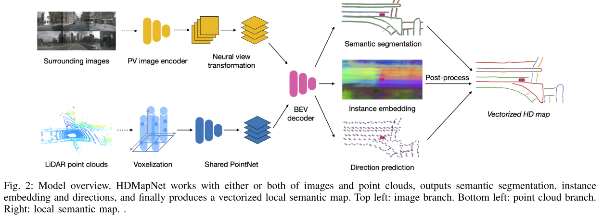
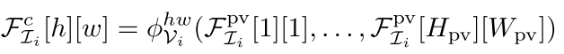
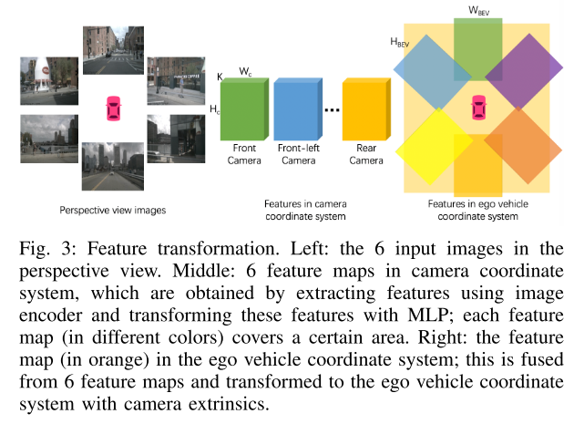
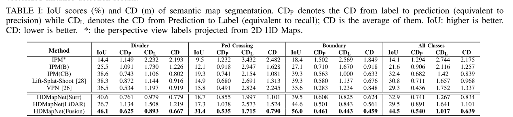
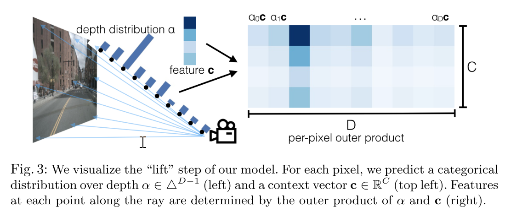

# HDMap

## 一、HDMapNet

### 1、摘要

​		高精度地图主要作用是估计局部语义。传统方法需要大量的人工操作和人工标注，这限制了高精度地图的扩展。本文，我们引入局部语义地图学习的问题，即基于传感器感知内容动态构建矢量语义。与此同时，我们引入一种局部语义地图的学习方法，称为HDMapNet。HDMapNet通过将环视的摄像头和雷达点云来编码图像特征，之后在鸟瞰视角预测矢量图元素。我们的方法在nuScenes数据集上表现比baseline方法要好，需要注意的是融合方法在所有指标上超过已存方法50%。此外，我们提出了语义级别和实例级别的评价指标。最后，我们显示我们方法预测局部一致图。

### **2、模型结构**

​		本文实际除了预测车道线以外还预测了局部一致的语义地图。同时，本文借鉴了多个视角摄像头感知的经验，采用交叉视图传感方法以矢量形式生成地图元素。本文是从单帧图像和点云来预测图像元素。整个架构如下所示，主要包含四个神经网络结构。

(1)透视图编码；

(2)神经网络视图变换；

(3)基于点云的pillar-based编码；

(4)地图元素解码。

​		透视图编码就是采用卷积方法得到Hpv*Wpv * K，表示高、宽和特征维度。

​		神经网络结构如下图。首先从透视视角转换图像特征到图像坐标系统，之后到鸟瞰图。其中，透视图和摄像头坐标系是通过MLP实现的。

​		将透视特征图中每个像素与摄像头坐标系下的每个位置通过MLP建立联系，得到相机坐标系下Hc*Wc的特征图。对于鸟瞰图的特征是通过摄像头外参进行几何投影得到。Hbev和Wbev表示鸟瞰图的宽和高，最终图像特征Fbev是多个Nm摄像头特征的平均。

​		整体架构：BEV的解码是具有3个分支的全卷积网络，称为语义分割分支、实例分支、方向预测分支。输入是图像和激光点云在bev下的特征。实例检测模块是对鸟瞰图实例进行聚类。为了容易标记，我们遵循了[33]的准确定义，C是用于聚类数量的真值，Nc是元素类别c。

​		方向预测：我们的方向模块目的为了方向预测对于每个车道节点C。方向是以单位圆来均分为Nd个类。我们将当前节点分类为D，则下一个叫节点的方向是Cnow+step*D，这里的step是预先设定的步长。对于有两个方向，则认为两个方向都是有效值并标记为1，其余标记为0.对于很对不在线上的点，则没有方向信息，即为0向量，在反向传播时不进行。我们使用softmax作为激活函数。

​		矢量化：在推断过程中，我们首先实例聚类，使用方法是Density-Based  Spatial Clustering of Applications with Noise（基于稠密的空间噪声聚类)，之后通过NMS进行冗余点剔除，最后，根据方向通过贪婪方式连接像素点。

### **3、对比实验**

​		对比实验比较了几种方法：

(1) 反透视映射(IPM)

(2)在鸟瞰图进行检测IPM(B)

(3)(Lift-splat-shoot)估计透视图像深度，之后将2D图像转到到3D点云并投影到本车坐标下。

(4)View Parsing Network.[26]剔除一种简单的转换模块将特征图转换到鸟瞰图，使用了视角关联模块来建模关系。之后通过平均pooling来融合多图像在鸟瞰图中的特征。

[33]Semantic instance segmentation for autonomous driving,2017,CVPR	

二、Lift-Splat-Shoot

​		论文《Lift, Splat, Shoot: Encoding Images from Arbitrary Camera Rigs by Implicitly Unprojecting to 3D》的基本结构与HDMapNet比较类似，应该是HDMapNet是在该文章的基础上发展而来的，这里的差别是在图像提取特征到相机frustum空间的转换过程中不太一样。其中HDMapNet是通过MLP来学习出的转换并且转换是转换到相机坐标系的平面，而Lift-Splat-Shoot是根据单目学习的深度分布，来直接将特征根据权重编码到不同的距离上形成一个视锥的点云特征，之后借鉴pointpillars的思路，将每个点付给最近的pillar，之后采用一个sum pooling的操作完成BEV视图特征图的构建。具体结构如下：

 