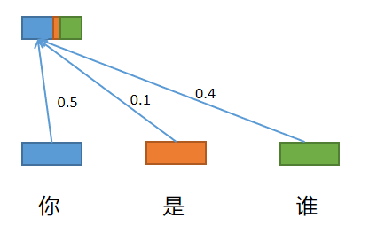

## transformer解读

##### 一、transformer 发展历程

2017.6  Transformer   solely based on attention mechanism, the transformer is proposed and shows great performance on NLP tasks

2018.10 BERT Pre-training transformer models begin to be dominated in the field of NLP;

2020.5 GPT-3 A huge transformer with 170B parameters, takes a big step towards general NLP model.

2020.5 DERT A simple yet effective framework for high-level vision by viewing object detection as a direct set prediction problem.

2020.7 iGPT The transformer model for NLP can aslo be used for image pre-training.

2020.10 ViT Pure transformer architectures work well for visual recognition.

2020.12 IPT The first transformer model for low-level vision by combining multi-tasks.

##### 二、transformer介绍

1、self-attention介绍

在语言和图像中，模型需要重点关注的部分就是注意力机制。通过attention的机制将上下文的信息融合起来得到融合上下文的特征，如一个句话的特征。

