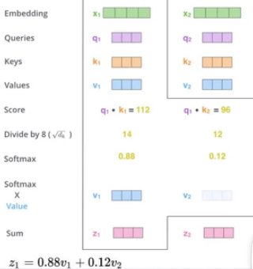

## transformer解读

#### 一、transformer 发展历程

2017.6  Transformer   solely based on attention mechanism, the transformer is proposed and shows great performance on NLP tasks

2018.10 BERT Pre-training transformer models begin to be dominated in the field of NLP;

2020.5 GPT-3 A huge transformer with 170B parameters, takes a big step towards general NLP model.

2020.5 DERT A simple yet effective framework for high-level vision by viewing object detection as a direct set prediction problem.

2020.7 iGPT The transformer model for NLP can aslo be used for image pre-training.

2020.10 ViT Pure transformer architectures work well for visual recognition.

2020.12 IPT The first transformer model for low-level vision by combining multi-tasks.

#### 二、transformer介绍

##### 1、self-attention介绍

​		在语言和图像中，模型需要重点关注的部分就是注意力机制。通过attention的机制将上下文的信息融合起来得到融合上下文的特征，如一个句话，对于你这个词从原只有蓝色的特征融合了整个句子中所有的词后得到的特征，而融合过程中采用不同的权重进行融合。

​		那么如何进行上下文的信息融合呢，也就是上文中的特征、权重都是如何产生的呢？具体如下：

​		这里首先在原始特征向量x1、x2的基础上生成三个对应向量q、k、v，其中q和k用于计算权重值，而v相当于对原始特征向量的转化，对于每一项，首先通过q与其他所有项的k进行相乘得到权重，之后乘以对应v相加得到最终融合全局信息的特征向量。

​		在实际应用中是需要训练q、k、v对应的权重矩阵Wq、Wk、Wv，之后将原始特征与对应的权重矩阵相乘得到q、k、v，具体如下：

​		transformer主要的作用是将全局上下文的特征进行关系的计算，之后根据关系的契合程度进行特征的融合。特征关系契合程度的计算是通过查询向量q与每一个关键向量k的乘积得到的，可以简单理解为两个向量的内积，契合程度越高或者说该特征对当前特征影响越大，得到内积(权重)越大。具体如下：

​		这里计算第一个特征向量与另外两个特征向量的权重，可以看到第一个特征向量与本特征向量的契合程度更大，所以得到的权重越大。

​		下面假设有4个特征向量的输入，那么对于第一个特征向量的q1通过与k1、k2、k3、k4相乘得到权重，权重值可以通过归一化的操作后再与value1、value2、value3、value4相乘，之后相加得到特征1的最新表示。如V1=0.4value1+0.1value2+0.3value3+0.2value4：

​		那么整个Attention的计算流程如下：

(1) 每个词的Q会跟每个K计算权重得分；

(2)Softmax后就得到整个加权结果；

(3)通过加权特征之后，每个词看到的将会是整个输入序列；

(4)之后按照前面的方式计算所有的特征；

​		该方法相当于对于每一个特征向量都进行了重构，重构的方式是融合了整个句子所有的特征。该思想是2017年Attention is all your need论文中的内容。开始了transformer的时代。

​		需要注意的一点，这里除以了8就是为了将权重值减小一些，按照64开根号进行除，防止做归一化的过程中计算e的次幂时比较大。

##### 2、Transformer介绍		

​		Transformer主要是一个backbone，能够更好的提取了特征。根据前面transformer的发展，ViT是将transformer引入到了CV中。

​		Transformer使用在CV中需要解决几个问题：

​		(1) 之前transformer是用在语言领域，那么每个词的特征向量是固定的，同时有多个特征向量。而图像只有一张图；所以解决方式是将图片分成N*M个patches，每个patch相当于一个特征向量；

​		(2)接下来对每个patch拉成一个向量，之后可以通过全连接的方式对特征进行重构，即Linear Projection of Flattened Patches解决的。

​		(3)目前对于多个patches按照不同的顺序进行 encoder实际上一样的，所以需要通过position Embedding的方式将位置信息加入进来。编码方式可以通过1,2,3,4...方式进行编码还是通过(1,1)（1,2）...这种二维编码实现，通过实验验证两者是差别不大的。

​		Transformer也存在一定问题，就是训练需要的数据量和计算资源比较大。

##### 3、Multi-headed机制

​		前面介绍了采用一组q,k,v的权重计算出新的特征，实际上可以通过多组q,k,v的权重来计算出多个特征，之后将这些特征concatenate一起后经过一个全连接方式得到融合多种注意力下的新特征，即称为多头机制，具体如下所示：

​		这里对于一个特征向量X通过attention方式生成8个特征分别为Z0-Z8，随后进行连接并通过全连接层得到最终的新特征Z。

##### 4、ViT介绍

​		对于ViT的工作前面简单介绍了一下，这里在详细介绍一下各步骤的操作：

​		(1) 将图像平均分成多分，如N*M份，则每一份的维度为a * b * 3，对这个维度的patch进行卷积操作得到如256维向量，即实现将patch特征拉成一维；

​		(2)通过下图粉色区域的Linear Projection of Flattened Patches，将256维向量通过全连接的方式扩展成1024维向量；

​		(3) 对得到的特征向量进行位置编码，这里采用1,2,3...9的方式进行编码。由于ViT是进行分类任务，所以这里增加了0位置的编码，用于增加类别的信息，之后再transformer Encoder的过程中，0位置的特征向量会融合全局上下文特征，最后用第0位置的特征向量进行全连接MLP即可得到1000类别分类；

##### 5、DETR介绍

​		前面介绍的transformer主要是做了Encoder的工作，是将图像特征提取的更好，但无法做检测等任务功能，而DETR是在此基础上增加了目标检测的功能，可以叫做decoder，同时，目标检测不再需要faster-rcnn做proposals，不再需要anchor，不再需要NMS，就是这么神，接下来看看是怎么超神的。

​		DETR前面的encoder部分与上面ViT提到的基本一致，将图像进行分块之后经过CNN得到一组图像特征，之后通过transformer 进行encoder，对于decoder做法是首先规定预测100个坐标框，其中包含需要检测的物体，如果检测的物体小于100个，则其余的目标框为非物体。做法的基本思想是初始化100个初始向量，之后让每个初始向量融合信息并预测物体，这里物体的过滤出来，其他的过滤掉就ok了。如下图所示：

​		encoder的目的就是将固定的patches得到对应的特征向量，下面具体介绍一下decoder的做法，这里面的核心是object queries，即生成的初始化的目标query。那么encoder提供的主要是k，v的部分。这里的每个q与k和v进行融合得到该query是否是一个目标。

			

​		具体细节如下：

​		(1) 100个object queries每个都采用0+位置编码的方式进行初始化；

​		(2) 首先object queries先进行多头自注意力学习，这里是多个object queries之间先进行信息的融合，形象理解是通过自注意力学习协调内部不同queries需要负责的任务；

​		(3) 对于image的特征进行encoder的过程中也是通过多头自注意力进行特征信息的融合；

​		(4) 对于object queries最终提供的是q，对于image特征最终提供的是k和v，在融合信息的时候采用object queries的q和image的k和v进行融合，这里融合称为多头交叉注意学习，即Multi-Head Attention或 Multi-Head Cross Attention机制。随后经过多层迭代后得到的特征进行目标类别和box的预测，迭代的过程都是通过query和image特征中的k和v进行融合的。其中多一个FFN是全连接层。

​		(5)对于传统的transformer用于语言处理时是具有Mask机制的，即在训练过程中需要屏蔽后面内容的影响，但是在图像感知中是不需要的。

​		(6) 对于最终输出100个预测框，加入实际图像中只有2个真实目标，则如何计算loss。这里使用的是匈牙利匹配算法实现，按loss最小的组合，剩下的98个都是背景。

​		(7) 在decoder的交叉注意迭代过程中，每一层都可以进行loss计算。

##### 概念：多头自注意力(Multi-head self attention)和多头交叉注意力(Multi-head cross attention)

​		对于这两个概念的理解可以简单认为自注意力机制中的q,k,v的输入是来自于同一个数据源，而交叉注意力机制的q是与k和v来自于不同的数据源。同时，注意力模块的输出是与q相同的，所以自注意力可以认为是原始数据特征的提取，而交叉注意力是交叉数据特征的生成。

​		根据transformer提供的全局attention机制可以看到该框架可以对重合的物体进行很好的注意力关注。

#### 三、Transformer的作用

##### 1、将Transformer应用在backbone

​		前面介绍了自注意力机制与交叉注意力机制的区别，实际上交叉注意力机制就是最原始提到的注意力机制，甚至它的提出还在Transformer之前。最早提到注意力机制的是发表在2015年ICLR的文章《[Neural Machine Translation by Jointly Learning to Align and Translate](https://arxiv.org/abs/1409.0473)》，而在《[Attention is All you Need](https://arxiv.org/abs/1706.03762)》文章中主要是将双向RNN编码替换成了自注意力模块。所以很多说法中注意力机制是指的交叉注意力机制。

​		在很多关于CV的应用中是利用transformer的自注意力机制，例如在ViT《[An Image is Worth 16x16 Words: Transformers for Image Recognition at Scale](https://arxiv.org/abs/2010.11929), ICLR 2021》和Swin Transformer《[Hierarchical Vision Transformer using Shifted Windows](https://towardsdatascience.com/arxiv.org/abs/2103.14030)》中，通过自注意力机制实际增强了提取特征backbone的能力，然而在考虑Transformer建构对训练资源、部署资源的需求，实际上并没有比CNN更具竞争力。在实际产品中使用Transformer用于特征提取主要能说明有钱(目前看来)。

##### 2、将Transformer应用在视角转换

​		在另一方面，交叉注意力机制实际上是有很好的应用前景。前面介绍的DETR《[End-to-End Object Detection with Transformers](https://arxiv.org/abs/2005.12872), ECCV 2020》是通过采用固定数量的object queries来学习目标检测结果，仿佛是提供预先的空白模板，之后通过交叉注意力机制来填充这些空白的模板。		

​		那么根据这个启发，交叉注意力机制用于视图转换也是可以的，如下将object queries替换成BEV queries，同时对于特征提取可以采用不同的backbone。

​		采用类似方式进行图像视图转换的论文解析如下：

(1)  PYVA

​		论文《[Projecting Your View Attentively: Monocular Road Scene Layout Estimation via Cross-view Transformation](https://openaccess.thecvf.com/content/CVPR2021/papers/Yang_Projecting_Your_View_Attentively_Monocular_Road_Scene_Layout_Estimation_via_CVPR_2021_paper.pdf), CVPR 2021》是第一个明确提出交叉注意力机制可以用于图像视图转到到BEV空间。该任务主要用于在BEV特征上的车道轮廓与车辆语义分割检测。

​		PYVA首先使用MLP来将图像空间特征X转换到BEV空间X'，采用另一个MLP将X'反投回图像空间X''，这样使用X和X''之间的循环一致性损失来使得X'尽可能保留相关的信息。

​		PYVA使用transformer的交叉注意力模型利用BEV特征X'生成query以及输入X特征生成k和v。这里没有对X'特征为BEV空间进行明确的监督学习，所以是通过下游在BEV空间中的任务loss来隐式监督学习的。

(2) NEAT

​		论文《[Neural Attention Fields for End-to-End Autonomous Driving](https://arxiv.org/abs/2109.04456), ICCV 2021》中的创新点是对于每一个给定的位置(x,y)，利用MLP结构以图像特征和位置(x,y)作为输入计算出权重图(相当于q*v的到权重)，之后权重图乘以原始的图像特征得到给定位置(x,y)在目标BEV的特征。那么如果通过这种方式对BEV视角下的所有栅格位置进行跌打，可以得到BEV下的特征图。

​		对于NEAT模块与交叉注意力机制比较相似，主要的不同是计算q与k的权重时采用了MLP。对于采用MLP与采用交叉注意力方式不同点是MLP的方式可以保持交叉注意力机制的数据依赖特性，但是却没有置换不变性。

​		总结来讲就是NEAT使用MLP来将图像转到BEV空间。

(3) STSU

​		论文《[Structured Bird’s-Eye-View Traffic Scene Understanding from Onboard Images](https://arxiv.org/abs/2110.01997), ICCV 2021》类似DETR使用离散的queries用于目标检测，同时STSU不只是检测动态目标，还有静态道路结构。这里采用了两组queries集合，一组用于道路中心线，一组用于目标。

​		论文LSTR《[End-to-end Lane Shape Prediction with Transformers](https://arxiv.org/abs/2011.04233)*, WACV 2011*》对于道路预测也使用了Transformer，还有一个类似论文HDMapNet《[An Online HD Map Construction and Evaluation Framework](https://arxiv.org/abs/2107.06307)*, CVPR 2021 workshop*》，它在图像空间进行道路结构预测，但这篇论文没有使用Transformer。

(4) DETR3D

​		DETR3D论文《[3D Object Detection from Multi-view Images via 3D-to-2D Queries](https://arxiv.org/abs/2110.06922), CoRL 2021》类似DETR使用离散queries进行目标检测。这些queries是直接在BEV空间。

​		在BEV进行感知相对于mono3D的一个优势是在摄像头视角重叠区域，单目对于截断的物体只能通过预测的方式进行目标检测，而DETR3D则能够得到比较好的效果。这个在tesla AI day中也进行了说明。

​		同时，DETR3D使用多个tricks进行性能提升。一个是通过迭代精细化object queries。本质上，预测bbox在BEV的中心再使用相机内外参反投影回图像，对多相机图像特征进行抽样和集合来优化queries。这一操作被用于多次重复来提升性能。第二个trick是用提前预训练的mono3D模型作为backbone，初始化对于基于Transformer的BEV感知网络比较重要。

(5) Tesla方法

​		在2021年的tesla AI Day上，tesla展现其内部的网络结构，其中最主要的模块就是图像到BEV的转换以及多摄像头融合，这里的核心就是交叉注意力机制。

​		通过初始化一个你希望输出大小的空间的光栅并使用sine和cosine来编码输出空间的位置，之后用MLP进行encoded成一组query向量，之后所有的图像会输出他们自己的keys和valuse，之而后这些queries、keys、values将反馈到交叉注意力模块中。

​		这里比较关键的是视图转换中query在BEV空间的生成，它是通过BEV空间中以光栅化方式生成的，类似DETR这种空的模板通过连接了位置编码。同时会有一个上下文信息连接在位置编码上。这里猜测是将图像空间的信息经过稀疏话后平铺到BEV的grid上。

#### References

https://towardsdatascience.com/monocular-bev-perception-with-transformers-in-autonomous-driving-c41e4a893944

https://www.bilibili.com/video/BV1M44y1q7oq?from=search&seid=10327593834426555334&spm_id_from=333.337.0.0

