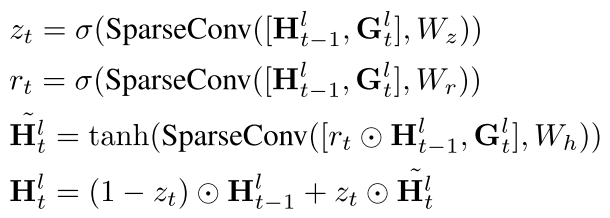
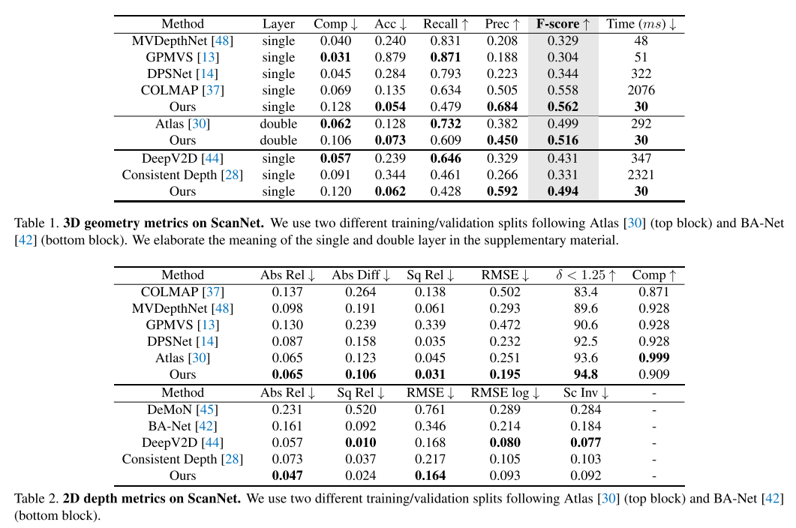
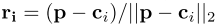

## 三维重建算法

##### 一、colmap

​		传统三维重建算法，目前性能的sota，但是速度比较慢，连续帧摄像头位姿估计等耗时不大，主要的时间是消耗在稠密点云构建和mesh生成上。

##### 二、NeuralRecon

​		论文《NeuralRecon: Real-Time Coherent 3D Reconstruction from Monocular Video，2021，Jiaming Sun》跟之前的方法不太一致，以前方法是分别计算关键帧的深度图，之后再融合，本文是通过一个网络直接重建以稀疏TSDF卷表示的3D表面。这里利用一个基于学习的门控循环单元(gated recurrent units)TSDF融合模块来引导模型融合视频，这一设计可以让网络获取局部的平滑信息和全局的形状信息来构建连续的3D表面，最终实现准确的、连续的、实时的表面重构。实验在ScanNet和7-Scens数据库上得到sota的效果。

​		对于单关键帧进行深度图估计之后进行多帧间一致性和时序连续性融合过滤得到截断符号距离函数卷(truncated signed distance function (TSDF) volume)。这有两个问题，一个是重复计算；第二个是每个关键帧是单独计算的，即使每帧之间的位姿绝对准确，但单帧深度图估计存在比例因子(scale-factor)的变化，会导致建成的图会存在分层和发散的问题。

​		而本文中的方法是直接在TSDF特征空间内进行联合重建和3D几何融合，即NeuralRecon是在视角独立的3D空间内进行局部结合重建，而不是在视角依赖的深度地图中进行。具体的说，就是该网络将图像特征反投影成三维特征体，之后利用稀疏卷积对特征体进行处理输出一个稀疏的TSDF体。通过由粗到精的设计，TSDF体也在不同层级逐步精细化。通过直接重构隐式TSDF表面，网络能够学习到局部平滑和全局形状信息。与基于关键帧深度估计方法不同，在NeuralRecon网络中局部片段的连续几何特征会被学习，为了使当前片段重构和全局重构具有一致性，一个使用门控循环单元(Gate Recurrent Unit GRU)的基于学习的TSDF融合模块被提出。

###### 1、**相关的工作有以下：**

(1) 多视图深度估计

​		在深度学习之前，基于图像一致性、深度过滤、平面立体扫描等得到比较好的三维重建结果。

​		MVDepthNet 、CNMNet、Neural RGB- >D利用2D卷积来处理2D深度图代价体，这种可以减轻对图像一致性的依赖并实时得到多视图深度估计。

​		对于高分辨图像，PatchMatch的方法得到非常好的精度效果，当前依然比较流行。而基于学习的方法再解决MVS(mutli-view stereo)问题中在精度方面得到和最好性能，但是限于GPU的内存，只能处理中等分辨率的图像。

​		对于非实时的方法，采用3D卷积网络处理3D代价体，类似MVSNet，还有一些从粗到精的网络。类似于基于学习的SLAM系统。参见本文中引用[45, 57, 42, 44]。

​		**上面这些方法都是采用单视图深度图作为中间表示。**

​		SurfaceNet提出一种不同的方法，是用统一体度量(volumetric)来表示体积占用。最近，一个离线方法，atlas采用一个解码模块来预测TSDF体。与本文相关的还有使用递归网络处理多视图特征融合[5,18]。

(2) 3D表面重构

​		有了深度图估计并转为点云之后，接下来的3D重建工作是估计3D表面位置以及重建mesh。在离线的MVS处理流程中，泊松重构(poisson)和Delaunay三角化是常用的方法。而KinectFusion中，采用增量的体度量TSDF融合由于简单和并行话得到广泛应用。

(3) 神经网络隐式表达

​		最近，神经网络隐式表达得到重要发展[29, 33, 36, 17, 54, 25]。本文也是通过预测SDF来学习神经网络隐式表达来编码图像特征。类似PIFu[36]。主要的不同是我们使用稀疏3D卷积来预测离散TSDF体，而不是使用MLP网络。

###### 2、**本文架构：**

​		本文框架是在给定一组图像It和摄像头位置轨迹的情况下实时准确的重建3D几何场景，这里的摄像头位姿轨迹是通过SLAM系统提供的。最终希望实时重建出Stg，这里的t表示当前时刻，整个框架如图。

(1)关键帧选择

​		对于适合交互应用的实时3D重构算法，需要处理连续片段进行重构。这里选择了一些关键帧作为网络输入，为了有足够的运动距离同时要保持重构的多视图间有共视区，选择的关键帧既不能太远也不能太近。这里选择关键帧采用[13]准则，当平移大于tmax同时转动角度大于Rmax。一个有N个关键帧组成的连续帧称作局部片段(local fragment)。关键帧选出后，需要以固定最大距离来计算包含所有关键帧对应视野的立体片段包围体(fragment bounding volume FBV)，在每个片段的重构过程中值考虑FBV中的区域。

(2)视频片段联合重构与融合

​		本文中主要提出了同时重构局部视频片段(local fragment)Stl为TSDF体并与全局TSDF体Stg进行融合的深度学习方法。联合重构和融合时在局部坐标系下进行实现的，对于局部坐标系和FBV所对应的全局坐标系可以参看附属资料中的Fig.1.

​		**图像特征体构建：**

​		在局部视频片段的N张图像首先输入到图像backbone来提取多层级特征。类似之前体度量重构的工作[18,15,30]，这些提取的特征沿着每个射线反投影到3D特征体重。图像特征体Ftl通过多视图的特征根据每个体素可视权重平均得到。对于可视化权重表示在这个局部片段中，有多少个视角能够看到这个体素。反投影过程的可视化如下图i所示。

​		**粗到精的TSDF重构**：

​		 我们采用由粗到精的方法来逐渐精细化TSDF体。这里使用稀疏3D卷积来处理特征体Ftl。这个稀疏的体度量特征自然是由粗到精的设计。特别的，每个TSDF体(Stl)中的体素包含两个值，占据值o和SDF值x。在每一层，o和x是有MLP预测的。占据值表示这个体素在TSDF阶段距离lemda内的置信度。如果体素占据值低于稀疏性阈值theta则定义为空并将被稀疏化。这个稀疏的TSDF体可视化表示如上图中的iii。经过稀疏话后，Stl上采样2倍并与Ftl+1进行连接，并作为下一个层级GRU融合模块的输入。

​		取代关键帧单视图深度图估计，NeuralRecon一起联合重构了再局部视频片段中的所有物体表面。这个设计将引导网络直接从训练数据中学习表面。结果，重构的表面是局部平滑并在尺度上一致的。同时这个设计也减少的冗余的计算，因为每个区域在片段内只重构了一次。

​		**GRU 融合：**         

​		为了使片段间重构一致，我们提出基于历史重构进行当前片段重构的方案。我们使用了一个门控递归单元3D卷积变体模块[6]来实现。如上图中的ii，每个层级的图像特征体Ftl首先通过3D稀疏卷积来提取几何体征Gtl。而局部的隐式状态H(t-1)l是从全局隐式状态H(t-1)g中提取的，提取的区域是片段包围体。GRU融合Gtl和隐式状态H(t-l)l并得到新的局部隐式状态Htl，这个将通过MLP层来预测TSDF体Stl。此时，局部隐式状态Htl将用于更新全局隐式状态Htg，更新方式是通过替换相应体素的方式。正式的，用zt表示更新门，rt表示重置门，mu表示sigmoid函数，W*表示稀疏卷积，GRU融合过程如下式：

​		本质的，根据TSDF联合重构和融合的上下文，GRU中的更新门zt和忘记门rt用于决定采用隐式状态H(t-1)l中的多少信息与当前片段几何特征Gtl融合以及当前片段中的多少信息被融合进隐式状态Htl。作为数据驱动的方法，GRU看作是一种选择注意力机制来代替TSDF融合中卷积实现的线性平均操作[31]。通过GRU模块预测得到Stl，之后经过MLP网络利用历史片段积累上下文信息来是的局部片段的表面几何连续。这在概念上类似传统方法中的深度过滤，这些方法采用当前观察与一段时间融合的深度进行bayesian 过滤融合[38,34]。

​		**集成到全局TSDF体：**

​		最后一级的粗到精层级，St3用于预测局部稀疏TDSF体Stl。因为Stl和Stg之间的融合已经在GRU中被融合了，Stl可以通过直接替换相应体素来集成到全局TSDF Stg中。在每个时间t，Marching Cubes用于在Stg上执行mesh重构。

(3) 实现细节

​		我们用torchsparse[43]作为3D稀疏卷积的实现，图像的backbone是使用的MnasNet[41]的变体并用ImageNet预训练权重。FPN用于提取多层级特征。这里占据值o采用sigmoid层计算。最后一层的voxel的大小为4cm，而TSDF阶段阶段lembda设置为12cm。dmax设置为3m，Rmax和tmax设置为15度和0.1m。theta设置为0.5。最近邻插值用于从粗到精层级的上采样。

**性能比较如下：**

##### 三、人体的mesh重构

​		论文《End-to-End Human Pose and Mesh Reconstruction with Transformers，2021，Kevin Lin》利用人体表面mesh表示相对成熟的方案SMPL，其中SMPL提供的人体关节、人体表面等信息作为query项输入到Transformers中，通过transformer的迭代最后得出人体的SMPL表示。最终效果比较好同时也能解决一定单帧图像遮挡情况下还能有一定

##### 四、TransformerFusion

**1、摘要与序论**

​		论文《TransformerFusion: Monocular RGB Scene Reconstruction using Transformers，2021》引入的TransformerFusion是基于transformer的3D场景重建方法。模型输入是一段图像视频，transformer网络处理这些视频帧并融合观测特征到一个场景的空间栅格特征，之后这个栅格特征被解码为隐式的3D场景表示。这个方法的关键是transformer的结构可以通过场景重构任务监督学习使得网络关注场景中最为重要的图像帧。特征以从粗到细的方式进行融合，通知只有下需要的地方才记忆细等级的特征，使得网络需要较低的内存存储并以交互的速率进行融合。这个特征栅格之后会通过基于MLP的方法进行占据表面的预测进而被解码为高分辨率的场景结构。我们方法可以获得高精度表面重构，高于最好的多视图立体深度估计的方法、全卷积3D重构方法以及基于LSTM、GRU的递归网络进行视频序列融合的方法。

​		单目3D重构用于准确重构目标或环境的3D几何信息，这个主要用于机器人、自动计时、基于场景建模和编辑的增强现实和虚拟现实。此外，几何重构还是3D场景理解的基础，支持3D目标检测、语义分割和实例分割**[34, 35, 36, 29, 7, 43, 15, 16]**.。

​		目前，在多视角深度估计取得了显著进步，主要通过成对图像进行特征提取得到[42, 17, 19, 38, 13]，但这种平均特征的方式使得没有重点关注关键的视频帧，使得场景重建精度存在挑战。

​		本文核心就是使用transformer结构学习视频帧中的融合特征，期间重点关注具有丰富信息的关键帧来重构场景的局部区域。一个由粗到精的级联特征融合结构使得该框架可以以交互的帧率进行实时在线重建。

**2、相关工作**

​		多视图深度估计：COLMAP通过区块匹配(patch matching)方法的好很高的精度，是当前非常受欢迎的多视图几何的方法，但在缺少纹理信息的区域很难构建稠密的信息。目前基于深度学习的方法可以进一步解决上述问题，一些将多视图构建到一个cost volume中，也有一些通过概率过滤、高斯处理或LSTM层进行先前深度估计信息的反向传播，但这些方法智能构建单视角深度图，需要进一步融合才能能到整个场景的3D几何。

​		以单目RGB输入进行3D重构：多视图深度估计方法可以与深度融合方法 方法组合来获取场景重构的体积。MonoFusion[33]是第一个从PatchMatch方法变体过来的深度估计方法。然而，这种深度估计的融合噪声产生的伪影(artifacts)导致最近的方法都是预测3D的表面，而不是进行每帧的深度估计。一个通过两帧RGB图像来预测3D表面占据的方法是SurfaceNet，它采用3D卷积网络将体积平均colors转到了3D表面占据。Atlas将这个方法扩展到多视图，然而依然利用学习的特征来替代colors(colors没有理解具体含义？)。最近的NeuralRecon剔除一个实时3D重构框架，添加了GRU单元来从不同局部帧窗口中融合重构。我们的方法依然是融合RGB图像中学习的特征，并且是以一种在线的方式，同时我们基于transforer的多视图特征融合能够只依赖具有重要信息的帧来重构，并且获得更准确的3D重构。

​		Transformers在计算机视觉中的应用：Transformer在计算机视觉中的应用可以参看[22],该方法在计算机视觉中已经成功应用在目标价检测、视频分类、图像分类、图像生成以及人体重构。在本文中，我们提出基于transformer特征融合的方法用于3D场景重构。只要给一段场景的观察RGB序列，我们方法可以学习重要的特征信息来预测一个稠密的占据空间。

**3、使用Transformers的端到端3D重构**

​		给定义一段RGB图像序列，每个图像需要有对应的摄像头内参和外部poses，我们的方法通过预测每个3D空间点的占据值o[0,1]来重构了几何场景。下图显示了整个框架架构。首先每个图像通过2D卷积进行编码，得到粗和细的图像特征，之后我们构建一个3D特征栅格，并按照粗的3D栅格大小为30cm，细的为10cm，通过这些粗和细的栅格点作为query，从N张图片中请求相应的2D特征并用于融合粗和细的3D特征，这一过程通过transformer网络实现的。

​		具体方式如下：

​		这里需要注意的是我们存储了中间第一层transformer注意力权重wc和wf，这样可以高效的进行视角选择，这会在后面进行详细介绍。

​		为了更进一步的改善3D空间特征，这里在粗和精层次使用了3D卷积网络Cc和Cf。

​		最后，为了得到三维场景中每个点的几何占据，将粗和精特征通过3个方向的差值和一个多层感知模块MLP将特征转到占据属性。

​		获取表面占据属性是由卷积占据网络[32]和IFNet[5]产生的灵感，根据占据区域我们可以通过Marching cubes[27]的方法得到物体表面mesh。我们通过监督预测表面占据来训练该方法，损失函数如下：

​		这里Lc和Lf指的是在表面附近位置占据mask预测的BCE损失，Lo只的是表面占据预测的BCE损失。

**(1) 通过Transformers学习时间特征融合**

​		方法中的Tansformer模型T是独立用于空间中的每个点的，对于每个点p，transformer网络获取一些列的2D特征作为输入，这些特征是反投影到图像位置获取图像特征的差值得到的，而反投影图像位置只共通过透射变化来计算的。这里假定摄像头的内参和外参是已知的。

​		为了让transformer知道像素特征的有效性，如投影点可能在图像外部，我们提供像素有效性标识vi(0,1)作为输入。除了这些2D特征，这里还关联了投影深度以及视角线，如下式所示，这里ci表示第i帧图像的摄像头中心。这些输入特征通过一个FCN层被转换为embedding向量，之后被传递给transformer网络来预测融合特征。这里可以看到，w是指初始注意力层的注意力值，这将用于视角选择来加速融合。

​		

**Transformer结构**	

​		我们依据[12]进行了transformer架构的设计，包含了8个前向模块和注意力层，使用4层注意力头并且特征维度为256.前馈层独立处理输入。在初始注意力层对所有时间序列输入处理基础上，模型返回融合特征phi和注意力权重w，这个w用于后面选择哪个视角将会在一段长的输入视图中被保持。

**(2)空间特征细化**

​		当transformer网络融合2D在时间域上的观察，我们通过应用一个3D CNN来对空间精炼融合特征，从而显示的进行空间推理。首先粗的特征通过3D CNN来进行细化，之后这些特征会被上采样到细的分辨率，之后与细的进行连接并进行3D CNN，得到最后细化特征。最后，粗的特征和细的特征都会用于表面占据预测。

​		**由粗到细表面过滤：**

​		进一步精细的特征被用于预测接近表面位置的占据mask，这样可以过滤出空的稀疏的volume的区域，这样高分辨率计算较为复杂只在表面区域执行。为了得到这个结果，额外的3D CNN层Mc和Mf层被用于细化特征，输出每个栅格点接近表面的mask mc和mf。

​		只有空间区域中mc和mf大于0.5才会被进一步处理计算最后的表面重构，而其他区域本定义为空区域。这一改善提升了重构的整体性能，因为这里会使表面预测聚焦在接近表面的区域，同时也极大提升了速度。

​		监督表面mask mc和mf使用场景重构真值得到的mgtc和mgtf，指示栅格点附近在半径vc和vf之内的为需要的表面点。同样BCEloss被使用。

**(3) 表面占据预测**

​		最后表面重构预测通过解码栅格的占据值o(0,1)，当大于0.5表好似占据点。这里是通过MLP结构得到的。

**(4) 在线场景重构的视频帧选择**

​		对于三维场景重构我们目的是考虑所有的N张图像，然而这对长的视频和大尺度场景将非常耗计算量，这无法应用在线场景重构。本文是对每一帧视频进行增量处理，对于每一个3D点只是保留K=16个短剑测量。

​		在训练阶段，我们对训练的区域内随机使用Kt个图像。在测试阶段，我们利用初始transformer层的权重wc和wf来决定哪个视角被保留下来。特别的，对于一张新的RGB图像，抽取它的2D特征，之后对图像视锥中的栅格点进行特征融合，这反馈了融合特征和当前所有输入测量的注意力权重，当测量大于K时，在加入最新的测量帧之前会丢掉一个注意力权重最低的。这保证最小数量的输入测量，相当大的增加了融合处理时间。更重要的是，通过由粗到精的过滤，我们可以加入融合。最终我们方法在7FPS。

**(5) 训练策略**

​		使用了公寓室内RGB-D 的ScanNet数据库。

**4、试验性能**

参考文献：

[13]Deepvideomvs: Multi-view stereo on video with recurrent spatio-temporal fusion,2020

[22]Transformers in vision: A survey,2021

[32]Convolutional occupancy networks,2020, ECCV

[5] Implicit functions in feature space for 3d shape reconstruction and completion,2020,CVPR

[27]Marching cubes: A high resolution 3d surface construction algorithm, 1987.	

[12]An image is worth 16x16 words: Transformers for image recognition at scale, 2020.

[29]Rfd-net: Point scene understanding by semantic instance reconstruction,2020.

[7]3dmv: Joint 3d-multi-view prediction for 3d semantic scene segmentation,2018.

[15] 3d-sis: 3d semantic instance segmentation of rgb-d scans, 2019.

[16]Revealnet: Seeing behind objects in rgb-d scans, 2020.

Multi-view Monocular Depth and Uncertainty Prediction with Deep SfM in Dynamic Environments

