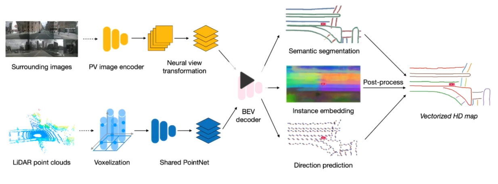

## 下一代视觉感知方案

##### 一、3D视觉工坊鉴智机器人朱政《自动驾驶中的视觉感知技术》报告

1、鉴智公司战略：提供以视觉为中心的高级别自动驾驶解决方案

端到端4D感知和预测

学术界开源数据：

其中waymo open是2019年开发的最大的数据集，waymo open、Argoverse、KITTI3D都是具有双目图像。

自动驾驶workshop/benchmark

CVPR2021 workshop on autonomous driving， 网址：http://cvpr2021.wad.vison

举办了waymo和argoverse两个赛道比赛。

waymo主要包括四个：motion  prediciton challenge，interaction prediction challenge， real-time 3D detectioin，real-time 2d detection。

argoverse： 

stereo depth estimation chanllenge

motion forecasting challenge

streaming 2d detection

semi-synthesis: a  fast way to produce effective datasets for stereo matching.

单目视觉感知能力(数据集KITTI)：

双目视觉感知，可以做到40几：

Full Suround：

nuscenes

车道线分为四大类：

(1)基于实例分割；

(2)基于行分类方法；

(3)基于anchor方法；

(4)基于多项式参数的方法；

通过融合得到静态地图HDMAPNet：

采用激光雷达和图像融合方式：

直接得到向量化的local map。

HDMapNet: A Local Semantic Map Learning and Evaluation Framework

基于视觉进行自动驾驶：

(1) mono： supervised  self-supervised

(2)stereo matching

(3)multi view stereo

(4)full surround

