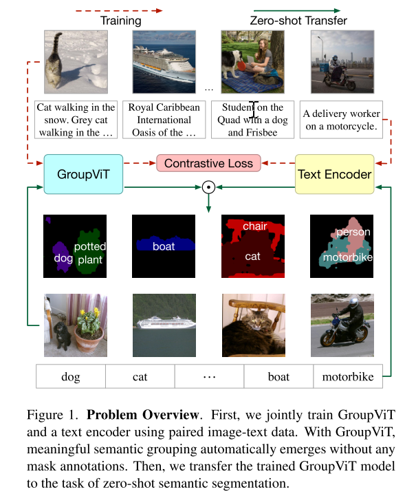
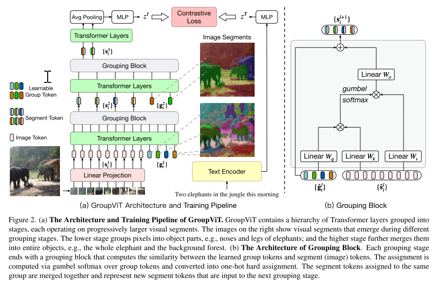
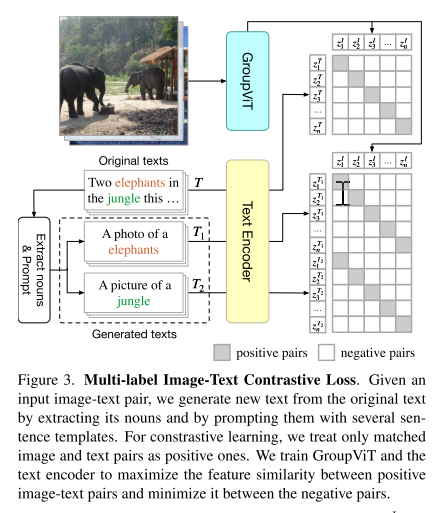

## 半监督算法

一、GroupViT

​		论文《GroupViT: Semantic Segmentation Emerges from Text Supervision，2022，Jiarui Xu》针对当前语义分割通常是通过像素级的标注和识别得到的，而本篇文章提出了只通过文本标注进行图像语义的聚类机制，并且文章提出了级联分组视觉transformer，该框架不只是学习常规的栅格结构的特征，而且可以将图像进一步分组为任意大小的图像区域。文章联合文本标注训练了GroupViT，成功实现对图像语义区域的分组和语义分割任务。并在PASCAL VOC 2012上对zero-shot图像得到51.2%的高精度。文章页面https://jerryxu.net/GroupViT/。

​		框架构建了图像模块和文本编码模块，通过对比loss来进行训练，之后将图像模块应用在zero-short的图像上。

​		对于图像模块采用了多层级的结构，第一层级用来学习部分目标，第二层级用来学习目标的整体语义。

​		通过对比loss来进行监督学习。