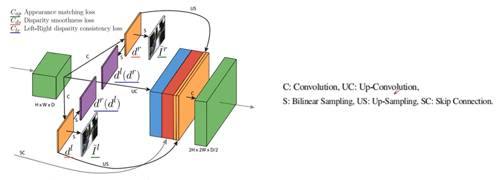

# 单目深度估计

## 一、LapDepth

​		论文《Monocular Depth Estimation Using Laplacian Pyramid-Based Depth Residuals,2021,M Song》采用多种级联结构如空洞卷积+多尺度pooling(ASPP)等方法，使单目深度估计达到比较好的效果。具体网络架构如下所示：

​		文章中有两个关键点可以关注：
​		(1)采用weight standardization，即权重标准化的方式加速模型训练和性能提升；

​		(2)loss在使用正常的L1 loss基础上增加了像素间差异的惩罚；

​		其中第二项给出了不同像素之间的差也要具有一致性。

## 二、Monodepth

​		2016年的Garg利用左右立体图像对，左侧的图像通过神经网络预测深度图，之后根据深度图和右侧图像重构左图，之后计算重构损失。由于图像重构模型在训练时不是可微的，导致训练困难，效果差。

****

​		在Monodepth论文中发现单独依赖图像重建会导致深度图的质量较差。所以论文中采用左右一致性损失，强制左右图像产生的视差图一致性，使得深度图结果更准确，提高性能和鲁棒性。

​		monodepth的方案。这里通过左图推断出左、右两个视图，只有左图一个位置的深度可以找到右图对应点的深度，通过深度一致性来增加约束。网络使用双线性采样器通过反向warping重建图像，模型是完全可微的。

​		网络采用4个不同尺度，在每个尺度上预测两个视差图，进行loss计算。损失函数如下：

​		主要包含3方面损失，Cap是指重建的图像与相应的输入图像相似，Cds使产生平滑的是插图，Clr使得预测的左右视差尽可能一致。并且每项都包含一个左视图和一个右视图版本。

（1）外观匹配损失(Appearance Matching Loss)

​		重构模块使用空间转换器网络(spatial transformer network)STN来采样输入图像，使用的是双线性采样，输出像素是四个输入像素的加权和，是局部完全可微的。Cap也可以称为光度图像重建损失，是L1和单尺度SSIM项相结合，比较了输入图像Il和重建图像I‘l之前的差别。这里SSIM使用3*3 block filter简化版的算法，alpha=0.85.

(2) 视差平滑损失（Disparity Smoothness Loss）

​		在视差梯度d上使用L1惩罚来使视差图局部平滑。由于深度的不连续性经常发生在图像的大梯度处，用一个边缘感知项加权这个损失函数。当图像梯度大时权重小，此时视差梯度权重变小。

（3）左右视差一致性损失（Left-Right Disparity Consistency Loss）

​		为了保证左右视图一致性，引入L1左右视差一致性惩罚，这个损失函数试图使用左视差图等于投影后的右视差图。

​		测试时，网络预测左视图在最大尺度级别的视差dl，其分辨率与输入图像相同。

## 三、SfmLearner

​		本论文采用单目的视频片段进行深度恢复，这里采用了两个独立的网络，分别预测单目深度和相邻位姿估计。在测试时深度模型和姿态估计模型可独立使用。

		本文也将视图合成作为监督信号。给定一个输入视图，利用网络估计深度图，通过不同相机姿态得到合成新视图，通过对比视图图像光度损失进行约束训练。

​		对于一组输入图像，It表示目标视图，Is表示其余源视图，视图合成损失函数为：

​		depth网络将目标视图作为输入，并输出深度图，pose网络将目标视图It和附近的源视图It-1和It+1作为输入，输出相对的相机姿势。使用两个网络输出结果对源视图进行反向warping，重建目标视图：

​		使用可微双线性采样机制，通过对4个邻居像素值做线性插值ps来进行Is(Ps)

​		对用于单目视频进行深度估计隐含如下假设：
（1）场景是静止的；（2）没有遮挡；（3）表面是朗伯表面，光度一致性误差是有意义的。

​		如果训练中存在违反假设的情况，则会导致梯度下降而收到影响进而抑制训练。为了提高鲁棒性，本文增加了可解释性预测网络。即为每一个目标-源图像对，输出一个逐像素的soft mask Es，用于表明网络的置信度，即每个目标像素成功建模直接视图合成的程度，于是损失函数变为

​		由于Es没有直接监督，所以网络会趋于0，所以增加了一个正则项，即1-Es，期望Es能够学习比较大的数。

​		为了克服梯度局部性，即ps在低纹理趋于或估计差距很大时会影响训练结果，于是采用多尺度和平滑损失的方式，平滑损失函数实际上是预测深度图的二阶梯度的L1范数。

## 四、Monodepth2

​		本文采用最小重投影误差的方法进行性能优化。即目标视图与前后源视图的误差选择最下的一项。		对于动态物体采用了auto-masking，即当重投影的误差低于原图误差即认为没有变化像素，损失不考虑。

​		对于多尺度估计这块之前不同尺度计算不同尺度的损失计算。本文是将低分辨率的深度图上采样到输入图像分辨率，在这个较高分辨率下进行损失计算。

## 五、FeatDepth

​		本文主要介绍特征度量损失。这里主要针对的问题是即使深度和姿态被错误估计，对于无纹理像素还是具有小的光度损失。本文提出了可以学习具有更好梯度的特征表示来克服这个问题。 

​		这里首先有一个特征提取网络featurenet，这个网络结构可以单独训练。通过学习deep feature能够对图像中的large patterns编码，去除冗余和噪声。这里损失函数主要有图像重建损失和两个正则化项，即判别损失Ldis和收敛损失Lcvt。

​		判别损失用来估计大梯度来确保学习的特征具有梯度。

​	有了特征之后，在进行深度损失计算时除了图像损失还是特征损失。

​		具体效果如下：

​		**为了应对场景中的动态物体，提出了多种解决方案**

## 六、Struct2depth

​		论文《Depth Prediction Without the Sensors: Leveraging Structure for Unsupervised Learning from Monocular Videos》也是利用自监督学习对场景深度和自身运动进行估计，无需深度真值，能够对移动目标建模，具有跨数据域的能力如从户外到室内场景。在学习过程中引入几何结构，对场景和单个目标进行建模，同时引入了在线细化方法，可以动态适应未知领域。

Practical Stereo Matching via Cascaded Recurrent Network with Adaptive Correlation