# 双目深度估计

## 一、传统双目深度估计算法

​		双目深度估计算法对应的传统方法及深度学习算法在框架上具有相对一致的结构，一般分为代价计算、代价聚合、视差计算、后处理优化，下面分别介绍每个模块的功能及算法示例。

### 1、代价计算

​		代价计算的目标是对左图中每个像素与右图中每个像素相似程度的计算。如果图像的分辨率是H*W，则计算的复杂度是H * W * H * W，为了简化计算，双目深度估计会进行标定实现基线对齐，使得左图每个像素只需要在右图中相同行进行视差点的计算即可，同时，可以根据实际需求限定深度估计的范围，同时换算成视差范围，如0-D。此时，左图每个像素只需要与右图同行中的D个像素进行相似度计算即可，此时计算复杂度变为H * W * D。

​		代价计算的一种方法是Census变换，即每个像素与固定窗口(如5 * 5)中每个像素值进行比较，如果大于则为1，如果小于等于则为0，以此生成一个0 1 表示的序列码，对于左图中一个像素与右图中一个像素的相似度即是两个像素对应序列码的不同位数和(也叫做汉明距离)。

​		这里最终得到一个H * W * D的三维数组，对应的D维信息表示的是对应位置像素不同视差相似度，之后在D维数据中选择一个最小的值为该像素的视差值。

### 2、代价聚合

​		代价聚合的目的是通过全局信息对代价计算的值进行优化，以解决代价计算步骤只考虑了局部相关性以至于对噪声敏感的问题。

​		一个简单的代价聚合算法可称为8-路径算法，这里可以简单理解为每个位置的代价值除了与当前计算的代价值相关还需要与周围像素以及前后深度的代价值进行一定的融合计算，如做平均等，最终通过视差计算得到的结果将会比较平滑。示例结果如下：

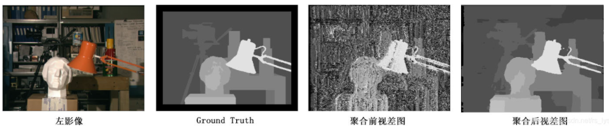

### 3、视差计算

​		视差计算目的是找到每个像素在不同深度上相似度最高的深度位置。一般采用赢家通吃(WTA)的算法，即选择最小聚合代价值所对应的视差作为最终视差。

### 4、视差优化

​		视差优化主要是对视差计算的结果进行后处理，如进行空洞补齐或者一致性的处理等。

## 二、深度学习方法双目深度估计

### 1、GCNet

​		论文《End-to-End Learning of Geometry and Context for Deep Stereo Regression》分为一下几部实现双目深度估计，具体阶段与传统算法具有一定相似性；

(1) 代价计算

​		传统方法是在图像原图进行代价计算，而深度学习的方法首先通过2D卷积进行特征提取，之后再特征的基础上进行代价计算，深度学习的代价计算有多种不同的方式，如特征差、特征concatenate、特征correlate，此时构建出来的代价矩阵一般是四维的，H * W * D * C，D表示视差范围。

(2)代价聚合

​		在构造完代价计算矩阵后通过3D卷积进行代价聚合；

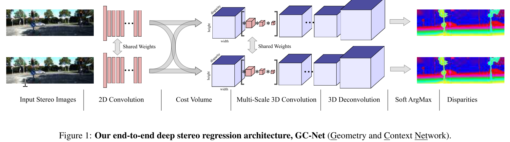

(3)视差计算

​		最后通过soft-max实现视差计算。

​		整个过程与传统深度估计类似。

### 2、AANet

​		论文《**AANet: Adaptive Aggregation Network for Efficient Stereo Matching**》提出了一种相对于采用3D卷积进行代价聚合而言更高效的一种立体匹配网络--自适应聚合网络(AANet)，它主要由两个模块组成，分别是同尺度聚合模块(ISA)和跨尺度聚合模块(CSA)，AANet旨在替代现有SOTA的立体匹配模型中常用的3D卷积，在加速推理速度的同时保持较高的准确率。

(1) 介绍

​		在基于深度学习的立体匹配方法中，以GC-Net为代表的网络主要依靠3D卷积方法进行代价聚合，该方法根据左右视图的特征，按照左图和有图偏差0,1,2...192个像素将极限上两个特征concatenate在一起，之后构成了一个H * W * D *C的4维矩阵称为代价矩阵(cost volume)，这里的D即0-192的视差深度，之后利用3D卷积进行代价聚合得到最终视差图，这种方式计算量比较大。

​		GA-NET在GC-Net基础上进行了一定优化，采用两个引导的聚合层来替代3D卷积，但该模型依然适用了15个3D卷积。

​		本文作者首先采用了特征相关性而非连接的方式构造cost volume，之后采用两个有效且高效的成本聚合模块ISA和CSA来实现成本聚合。

(2) 算法框架
		整个AANet网络结构图如下：

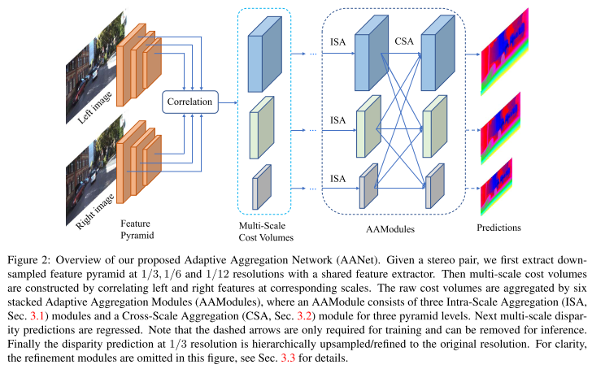

​		整个结构分为以下几个部分：
(1) 共享权值的Feature extractor特征提取；

(2) 多尺度3D代价矩阵构建，这里用到1/3、1/6、1/12；

(3)AA模块，每个AA模块包含一个ISA和一个CSA，共堆叠6个；

(4) refine模块，通过将多个预测值上采样到原始分辨率。

​		模型输出包含不同尺度下的视差图。接下来分别介绍不同模块：
(1)特征提取

​		主要通过常规的Resnet网络进行特征提取，之后构建金字塔结构得到分辨率为1/3、1/6、1/12的特征图。

(2)代价矩阵

​		这里构造代价矩阵采用特征相关性(即两个特征向量的内积)来构造3D的代价矩阵(H * W * D)，而不是采用连接方式构造4D的代价矩阵(H * W * C * D)。

(3) 代价聚集

​		得益于相关性构造的3D代价矩阵，首先在不同尺度上进行卷积，这里采用可变性卷积的方式防止在边缘处平滑的问题，因为对于正常卷积权重为固定会对边缘前景和背景分别融合信息。自适应方法是将区域限制在前景区域。

​		自适应交叉聚集采用跨尺度进行代价矩阵信息融合。公式如下：

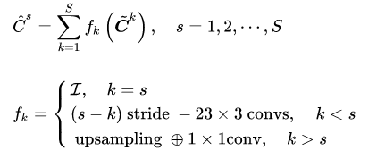

​		对于fk针对不同的尺度采用不同的方式，尺度相同的就直接使用特征，尺度大的通过下采样卷积获取特征，尺度小的通过双线性插值上采样获取特征。

(4)refine模块

(5) 视差回归

​		通过soft argmin的方式得到，这种可以输出亚像素级的视差图。

(6) 损失函数

​		损失函数主要是通过与视差真值的L1损失，其中KITTI有些地方没有真值。采用GA-Net生成真值，所以有真值的V(p)=1，没有真值的V(p)=0，利用pseudo值进行监督训练。

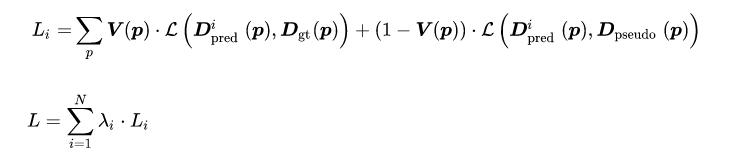

### 3、StereoDRNet

​		论文《StereoDRNet: Dilated Residual Stereo Net》主要是针对如PSMNet等模型产生的视差图不是几何一致的问题，提出了一种新颖的改进网络，将几何视差、光度误差和未确定的视差作为数据，产生重新定义的视差(通过残差学习)和遮挡图。后面对于vortex pooling等优化有助于锐边和细节的感知。

​		整个模型架构可以分为特征提取、代价滤波和视差估计改进三个模块，而非使用编码器-解码器通用的方案。算法整体系统流程如下：

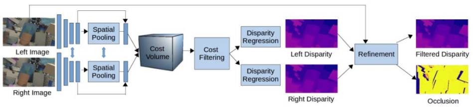

​		对于特征提取主要的创新点是局部特征图上选择Vortex Pooling的方式。及采用不同感受野的pool和卷积，具体如下所示：

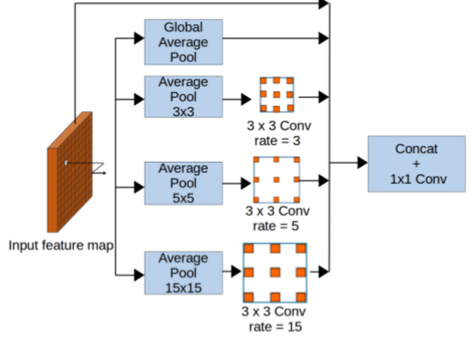

​		视差优化过程是引入了光度重建误差图、几何一致误差图和原图通过Refinement模型估计遮挡视图和残差深度，残差深度与左视图深度相加得到最终的深度。

​		光度重建误差如下：

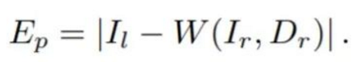

​		深度一致性误差如下：

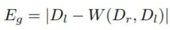

​		遮挡区域损失如下：

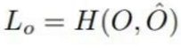

​		遮挡区域损失是根据真值O'进行交叉熵损失计算。

​		refinement后视差损失如下：

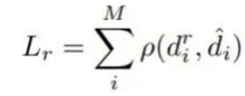

​		整个精细化模块结构图如下，其中通过左右目深度图和左右目原始图像构建几何误差和光度误差，将误差与左图concatenate一起进行预测遮挡和深度的残差。

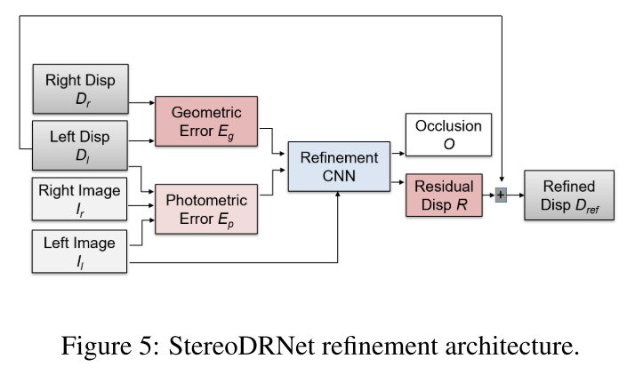

### 4、RAFT-Stereo 

​		论文《RAFT-Stereo: Multilevel Recurrent Field Transformers for Stereo Matching》主要是基于光流估计RAFT网络提出的针对双目深度估计网络。采用多层循环卷积模块进行深度值的不断refine。

​		整个网络输入是对于双目图，主体由三部分组成：特征提取、相关性金字塔和GRU迭代模块。

(1) 特征提取

​		特征提取模块首先将左右图像送入到feature encoder部分提取稠密的feature map，生成不同尺度的feature map。这些特征图用于构建相关金字塔。

​		还有一个结构用于提取左图的上下文信息，结构类似，其中左图的context feature用于初始化GRU模块的隐藏状态。  

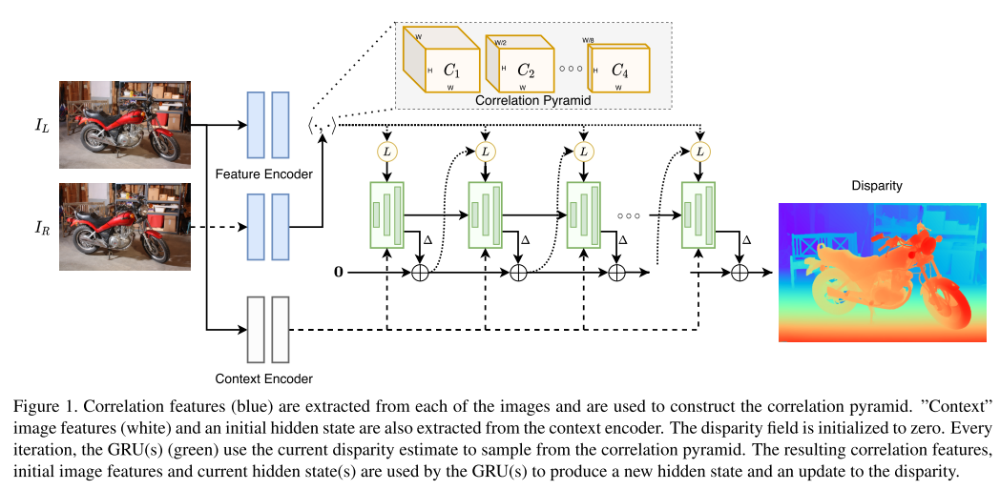

(2) 相关金字塔

​		相关性代价体(correlation volume构建)，类似于光流4D correlation volume，双目深度估计的中的两张feature map 通过在同一行W每个feature进行点集得到，于是输出的相关代价体维度为H * W * W。

​		通过对correlation volume的最后一个维度下采样实现不同尺度的correlation pyramid。生成H * w * w/2^k，这样在最后一维感受野在增大，同时保持在原图的分辨率。

​		为了在相关代价体重中选择对应深度的相关性信息，本文通过correlation lookup来实现，通过给定估计的视差，我们可以在correlation volume中反向寻找对应像素位置处的代价元素，即以层级的方式采用1D的网格来设置搜索范围，之后将不同层级搜索的元素concatenate一个独立的feature map。具体如下：

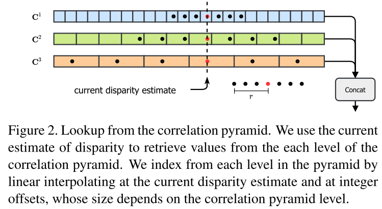

(3) 多层级更新模块(multi-level update operator)

​		在多层级迭代过程中，我们通过初始视差得到一系列视差图，每次迭代产生新的视差估计，根据视差估计查找相关代价体进而的到相关特征，correlation feature经过2层卷积，同时当前视差估计也经过2层卷积，之后correlation feature、disparity和context feature一起送入到GRU中。GRU来更新隐藏状态，这个新的隐藏状态用来更新视差图。

​		多层级隐藏状态：原始的RAFT是在一个固定的高分辨率上执行更新的，但这种感受野增加非常慢，这对于大的没有纹理的区域效果较差。本文采用多层级分辨率来解决，如1/8、1/16、1/32分辨率。多个GRU单元之间的隐式状态交叉互联。同时，相关性查询和最后的视差更新都是在GRU的最高分辨率上实现的。具体如下图所示：

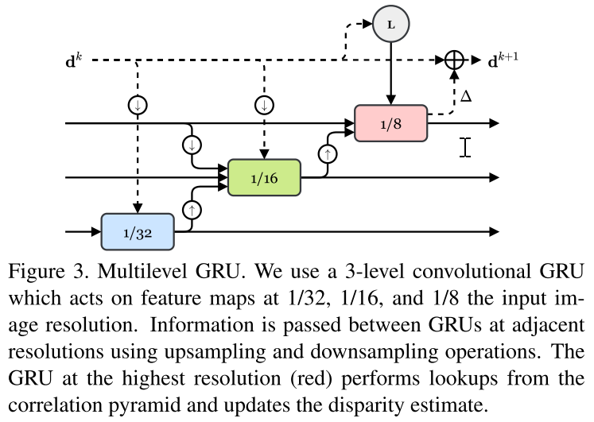

​		最后，全分辨率视差图的输出是采用RAFT中的convex upsampling  method实现的。

### 5、CREStereo

(1) 本文介绍

​		当前双目深度估计还是存在一定的挑战。猪油有以下困难的因素如：细结构、非理想校正、摄像头模块一致性、多种困难场景。本文提出多个新的设计来解决实际双目匹配问题：

​		(1) 为了更好恢复深度细节，这里设计了级联网络由粗到精更新视差结果，以及一个堆叠的级联推断结构；

​		(2)我们提出了一个自适应的组关联层用于减轻校正错误的影响；

​		(3)本文引入了一个新的合成数据库，主要关注困难场景用于一般化真实世界场景。

(2) 方法

1)自适应组相关层

​		局部特征注意力：相比于计算每对对应像素的全局相关性，我们只是在局部窗口匹配点来避免计算量。基于LoFTR的思路，在级联第一阶段相关性计算之前添加自注意力模块来聚集全局向下文信息。在这只有，我们添加了位置编码来增强位置信息。自注意力和交叉注意力交替计算，这里是一个线性注意力层来减少计算复杂度。

​		2D-1D交替局部搜索：不同于RATF输出4D H * W * H * W或3D H * W * W代价体，本文只计算局部搜索窗口输出H * W *D。局部相关计算(x,y)可表示为：

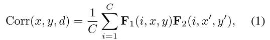

​		这里x'=x+f(d), y'=y+g(d)，f(d)和g(d)表示当前像素在水平和垂直方向固定的偏置。具体结构如下图所示：

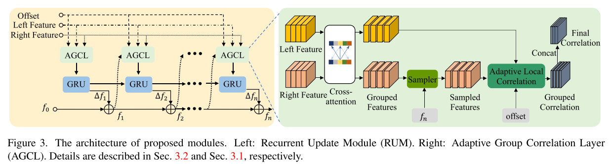

​		这里需要理解几个关键点，首先是sampler，这里的理解是根据计算的右图视差值fn将右图特征按照视差值的方式进行移位，使左图每个位置对于右图相同位置就是需要计算的相关性值；之后是相关性计算，相关性计算分为2D和1D两种，并且都设置了固定的窗口，

2）级联网络

​		为了利用低分辨率特征解决无纹理或重复纹理而高分辨率特征解决细节问题，本文提出级联优化对于相关性计算和视差更新。

​		Recurrent Update Module 是基于GRU模块和AGCL。这里不像RAFT中构造单独的相关层到一个体中，本文在每个级联结构计算相关性。如上图中的sampler采样特征以fn作为坐标点，这里f1...fn是在初始化f0的基础上迭代n次的中间预测。GRU块更新当前预测并反馈到AGCL中。

​		级联优化：除了第一层在1/16的输入分辨率上初始化视差为0，其他层级是以上一层的上采样版本作为输入。虽然处理不同层级的优化，所有RUM共享相同的权重。最后的优化后，convex上采样得到最终预测分辨率。

## 三、多视图深度估计

### 1、MVSNet

​		论文《MVSNet: Depth Inference for Unstructured Multi-view Stereo》采用多张视图作为输入，其中一张图作为参考图，其它图像作为源图像，输出为参考图像对应的深度图。整个流程实现方式如下：

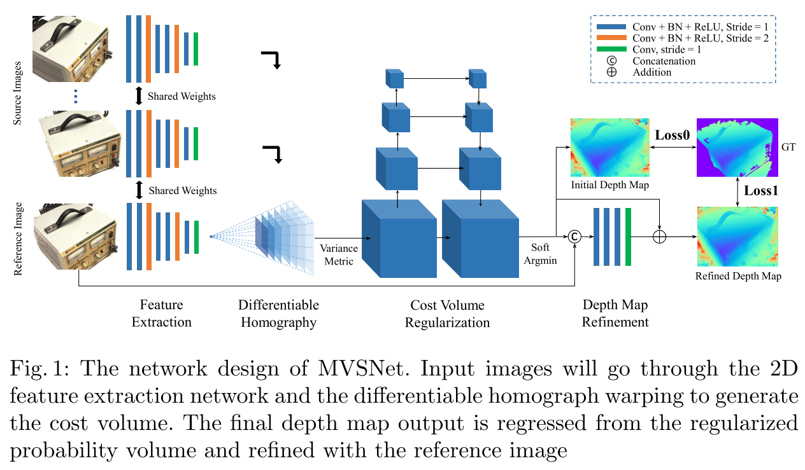

(1) 代价计算

​		这里首先需要将N张特征图转到参考图像不同距离特征图，距离可以根据需求进行设置，如1m-100m，每间隔1m设置一个。转换过程是根据相机内参、旋转、平移计算得到的单映矩阵实现的。此时每个源图像都会产生一个不同深度的代价，需要将多个不同深度的代价聚合成1个代价体。为了适应任意多的输入图像，这里提出了基于方差的代价体。具体如下：

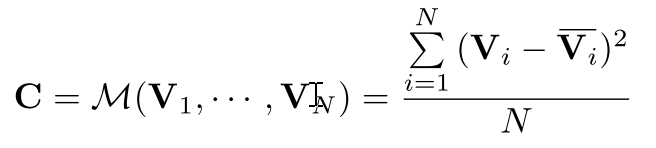

​		这里采用的方差而不是平均，因为平均不会提供多个特征图不同的信息，这种采用方差的方式会提升准确性。

(2) 代价聚合

​		代价聚合即采用3D卷积进行实现。

(3) 深度图计算

​		这里的深度图计算没有采用argmax操作，因为该方法没有办法进行亚像素估计，同时由于不可导无法进行反向传播。因为，本文在深度方向上计算期望值，即在所有的假设深度值上乘以概率权重得到，如下所示：

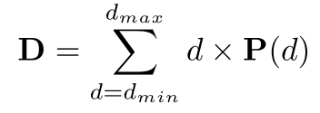

(4) 概率图

​		在深度方向上的概率分布也反映了深度估计的质量。我们发现在错误匹配的像素位置，概率分布式相对离散的而不是聚集在一个波峰。基于这个假设我们统计对应深度附近的几个波峰的累加值来确定深度置信度。具体如下图所示：

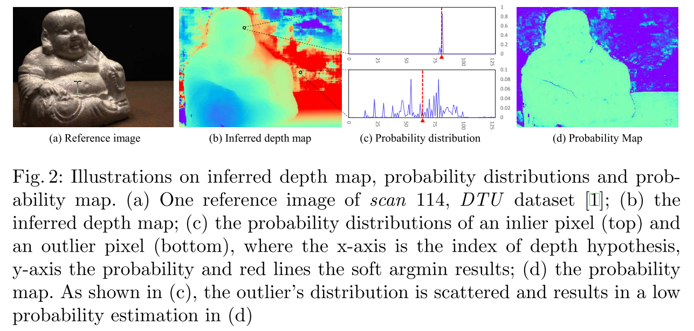

(5) 深度图优化

​		虽然输出的深度图是经过概率图进行限定输出的，但是在边缘部分还是会存在过度平滑的问题，这主要是由于比较大的感受野导致的，该问题类似于语义分割和图像抠图。由于参考图自然的包含了边缘的信息，我们使用参考图来对深度图优化。这里使用了深度残差学习网络，即深度图和经过resize的参考图连接在一起变成一个4通道输入，之后通过2D卷积网络学习深度残差。这个结果用于优化深度图。

​		

