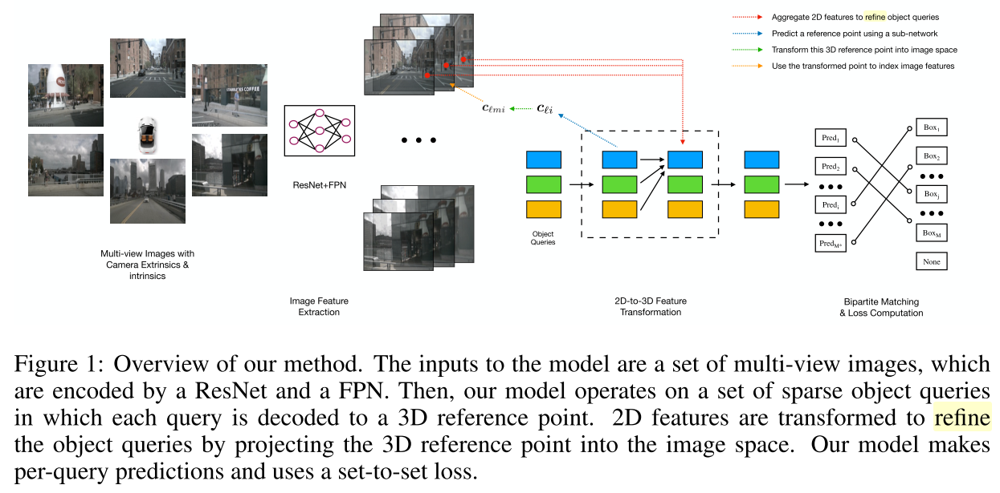
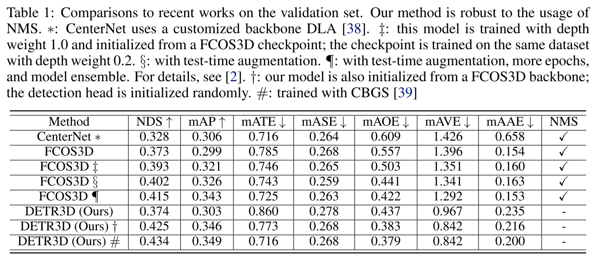
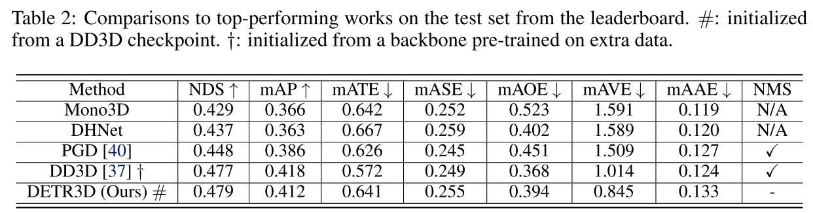
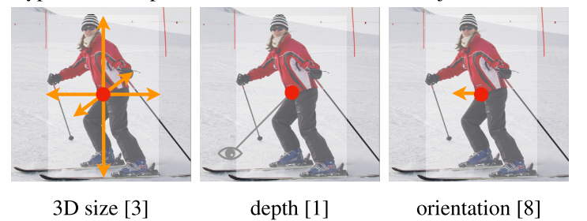
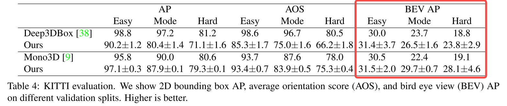
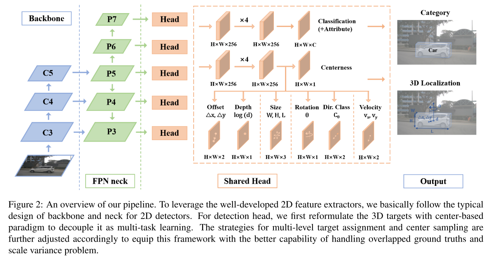
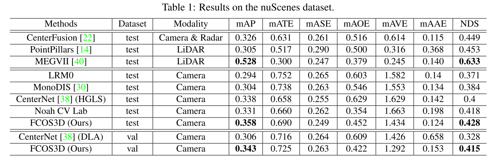
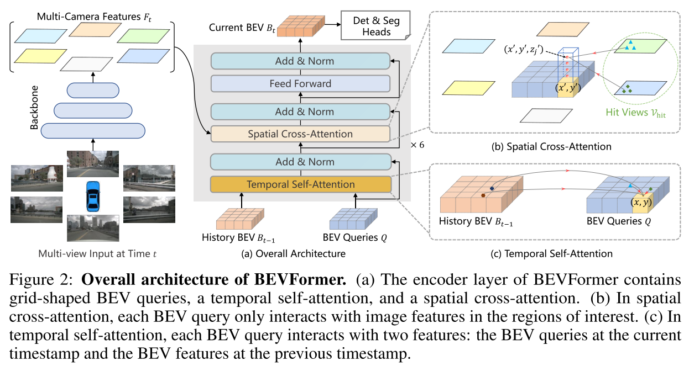
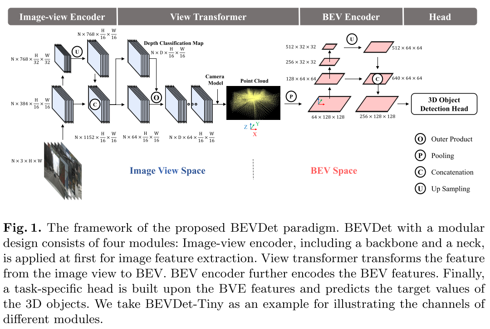
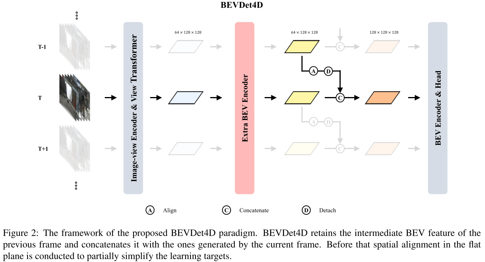

# 基于单目图像的3D目标检测

​		目前单目的3D目标检测主要由三个方向：

​		(1) 在2D boxes的基础上增加3D属性的回归；

​		《Monocular lifting of 2d detection to 6d pose and metric shape》

​		《Disentangling monocular 3d object detection》

​		(2) 基于每个2D anchor 和3D先验信息来预测3D信息；

​		(3) 采用额外关键点来预测额外的3D信息；

## 一、DETR3D

​		论文《[3D Object Detection from Multi-view Images via 3D-to-2D Queries](https://arxiv.org/abs/2110.06922), CoRL 2021》输入是车辆周围6个摄像头的图像，这些图像间有重叠fov，但不具备双目的功能，所以这里将DETR3D放入到单目图像的3D目标检测范畴。6个摄像头通过常规的CNN网络ResNet+FPN进行特征提取，之后在3D空间中生成Object queries，每个query都编码了3D位置(如何编码的需要查看代码？)，这些object queries会反投影到图像中，得到对应位置的特征，将这些特征连接在queries上来增加queries包含的信息，之后采用多头注意机制来增加queries对于object的特征，最后通过set-to-set损失函数来训练网络。

​		在nuScenes数据集上测试性能如下：

​		**从中可以看出，原始的训练实际上DETR3D并最好的，通过其他模型初始化backbone能够得到比其他模型更好的性能。**

## 二、CenterNet

​		CenterNet除了用在2D目标检测以外还用在3D的目标检测中，3D目标检测需要在检测的中点外增加三个额外的属性，分别是深度、3D信息和朝向信息。对于这三方面内容分别增加了独立的预测头部。

​		对于深度是很难直接回归的，所以对其进行了sigmoid归一化处理，使用L1 loss进行损失函数计算。

​		对于3D信息是三个值，我们直接回归长度信息，单位是m，采用L1 loss进行损失函数计算。

​		朝向默认是1维的信息，这个也很难回归。我们沿用Mousavian采用两个bins来代表朝向，特别的，朝向是用8个标量来编码的，对于每个bin对应4个量，对于每个bin，两个量用于左分类，两个用于回归每个bin的角度。

​		性能在KITTI数据集上如下，3D信息的准确性主要看BEV下的性能，大概在31%左右。

## 三、FCOS3D

​		FCOS3D是在FCOS框架的基础上建立的，对于FCOS类似CenterNet，只是CenterNet检测目标中心点，并通过中心点检测边框的宽、高，而FCOS是只要目标box内部点都进行预测到box四条边的距离，为了剔除边缘点性能差的问题，引入了centerness，即中心部分大于阈值的区域可以用于预测边框，其他区域不预测边框。

​		对于FCOS3D是在进行2D检测的基础上，增加了3D的head进行深度、size、朝向、类别等信息的检测。框架如下：

​		实际性能是在nuScenes中进行测试的，如下：

​		**对于性能的提升过程采用了多种策略，从中可以看出哪些策略对于模型的性能影响程度，影响比较大的是数据不同表示方式(？Depth loss in original space)、backbone、Finetune、more epochs&ensemble**。具体如下：

## 四、BEVFormer

### 1、介绍	

​		本文提出了一个新的BEVFormer框架，该框架使用空间时间transformer学习了统一的BEV表示来支持自动驾驶感知任务。简言之，BEVFormer通过提前定义的栅格BEV queries来获取空间与时间空间信息。对于空间特征提取，本文设计了空间交叉注意力使得每个BEV query可以提取感兴趣摄像头视角下的空间特征。对于时间信息，提出了时间自注意力来融合上一时刻历史的BEV信息。整个框架结构如下图所示：

​		整个BEV特征构建过程是通过6个encoder layer解决的，每一层首先使用BEV queries来获取之前BEV特征Bt-1上的信息，之后采用BEV queries 来从多视角摄像头特征Ft获取空间信息。经过前向网络，编码层输出优化的BEV特征，这个作为下一层的输入。之后以BEV特征Bt为输入，进行3D检测和图像语义分割。

### 2、本文改进点

​		对于空间特征提取，由于大规模输入，所以多头注意力的计算量非常大。这里开发可变性注意力，即query只关注感兴趣的区域，这个在3D场景的使用中需要进行改进。这里是将每个BEV位置对应的pillar间隔取点，之后反投影到2D特征图，这些反投影点附近的点作为query获取信息的对象，之后将获取的特征进行加权平均。

​		对于时间自注意力，本文首先将前一时刻BEV特征根据自车移动align到当前时刻，之后对于当前特征Q和前一时刻align特征B‘t-1进行连接。如果是第一个时刻由于没有前一时刻的BEV信息，则将Q复制连接一下。

增加了时域信息文章：

[6]Understanding bird’s-eye view semantic hd-maps using an onboard monocular camera. arXiv preprint arXiv:2012.03040 (2020)

[18]Fiery: Future instance prediction in bird’s-eye view from surround monocular cameras.International Conference on Computer Vision. pp. 15273–15282 (2021)

[38]Translating images into maps. arXiv preprint arXiv:2110.00966 (2021)

## 五、BEVDet

​		论文《BEVDet: High-Performance Multi-Camera 3D Object Detection in Bird-Eye-View》是在BEV空间下进行3D目标检测，整个框架使用的结构基本都是现有的模块。但是再数据增强方面做了新的策略并更新了非极大值抑制策略。本文的基本结构如下图所示：

​		本文分为四个结构进行模型构建，图像特征编码、视角转换、BEV编码、目标检测任务头。首先对于图像特征编码采用比较成熟的ResNet类似结构。对于视角转换采用了lift-splat-shoot方法，即估计图像视角下的深度，之后将图像视角特征转到到点云，最后通过垂直方向的pooling操作得到BEV视角下的特征。本文默认的深度预测是[1,60]米。BEV Encoder用于对BEV的特征图进行进行特征提取，这里采用ResNet的结构。Head采用3D目标检测的典型结构，如CenterPoint。

## 六、BEVDet4D

​		论文《BEVDet4D: Exploit Temporal Cues in Multi-camera 3D Object Detection》将空间3D的信息推广到采用空间和时间4D的信息来进行3D目标检测，以解决某一时刻特征不足对目标检测的限制。整个网络结构如下：

​		本文中只是在时间融合的过程中做了一定的改进，即保留了前一帧BEV的特征，之后通过本车运动转换矩阵T对前一帧特征进行转换，在转换过程中由于BEV下特征空间是稀疏的，所以需要进行双线性插值的方式进行插值，最后跟当前BEV特征进行concatenate。

