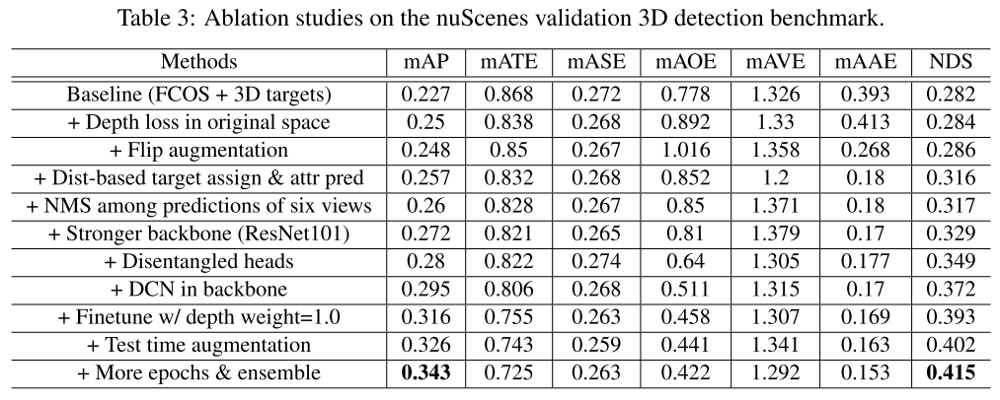

## 基于单目图像的3D目标检测

​		目前单目的3D目标检测主要由三个方向：

​		(1) 在2D boxes的基础上增加3D属性的回归；

​		《Monocular lifting of 2d detection to 6d pose and metric shape》

​		《Disentangling monocular 3d object detection》

​		(2) 基于每个2D anchor 和3D先验信息来预测3D信息；

​		(3) 采用额外关键点来预测额外的3D信息；

##### 一、DETR3D

​		论文《[3D Object Detection from Multi-view Images via 3D-to-2D Queries](https://arxiv.org/abs/2110.06922), CoRL 2021》输入是车辆周围6个摄像头的图像，这些图像间有重叠fov，但不具备双目的功能，所以这里将DETR3D放入到单目图像的3D目标检测范畴。6个摄像头通过常规的CNN网络ResNet+FPN进行特征提取，之后在3D空间中生成Object queries，每个query都编码了3D位置(如何编码的需要查看代码？)，这些object queries会反投影到图像中，得到对应位置的特征，将这些特征连接在queries上来增加queries包含的信息，之后采用多头注意机制来增加queries对于object的特征，最后通过set-to-set损失函数来训练网络。

​		在nuScenes数据集上测试性能如下：

​		**从中可以看出，原始的训练实际上DETR3D并最好的，通过其他模型初始化backbone能够得到比其他模型更好的性能。**

##### 二、CenterNet

​		CenterNet除了用在2D目标检测以外还用在3D的目标检测中，3D目标检测需要在检测的中点外增加三个额外的属性，分别是深度、3D信息和朝向信息。对于这三方面内容分别增加了独立的预测头部。

​		对于深度是很难直接回归的，所以对其进行了sigmoid归一化处理，使用L1 loss进行损失函数计算。

​		对于3D信息是三个值，我们直接回归长度信息，单位是m，采用L1 loss进行损失函数计算。

​		朝向默认是1维的信息，这个也很难回归。我们沿用Mousavian采用两个bins来代表朝向，特别的，朝向是用8个标量来编码的，对于每个bin对应4个量，对于每个bin，两个量用于左分类，两个用于回归每个bin的角度。

​		性能在KITTI数据集上如下，3D信息的准确性主要看BEV下的性能，大概在31%左右。

##### 三、FCOS3D

​		FCOS3D是在FCOS框架的基础上建立的，对于FCOS类似CenterNet，只是CenterNet检测目标中心点，并通过中心点检测边框的宽、高，而FCOS是只要目标box内部点都进行预测到box四条边的距离，为了剔除边缘点性能差的问题，引入了centerness，即中心部分大于阈值的区域可以用于预测边框，其他区域不预测边框。

​		对于FCOS3D是在进行2D检测的基础上，增加了3D的head进行深度、size、朝向、类别等信息的检测。框架如下：

​		实际性能是在nuScenes中进行测试的，如下：

​		**对于性能的提升过程采用了多种策略，从中可以看出哪些策略对于模型的性能影响程度，影响比较大的是数据不同表示方式(？Depth loss in original space)、backbone、Finetune、more epochs&ensemble**。具体如下：

