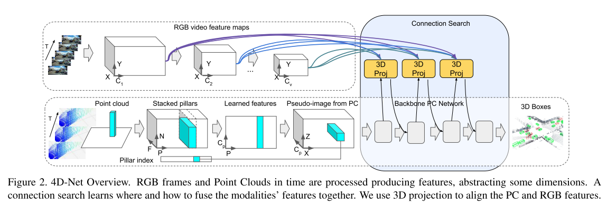

# 基于图像+点云的3D目标检测

## 一、Frustum PointNets

​		论文《Frustum PointNets for 3D Object Detection from RGB-D Data，2017》先在图像上检测目标物体的2D框，之后基于2D框可以得到3D点云的frustum，此时该frustum虽然缩小了物体的范围，但是依然具有其他前景和背景的点云，于是，在此基础上采用点云的网络如PointNet进行语义分割，将目标的点云分割出来，进而得到物体的3D位置。

​		其中对于3D点云进行语义分割以及根据语义分割的结果进行目标框检测的结构如下：

​		其中对比结果如下所示：

## 二、ImVoteNet		

## 三、4D-Net

​		本论文《4D-Net for Learned Multi-Modal Alignment》提出了融合时序点云信息和图像信息的3D目标检测方法，该方法基于waymo的数据集取得了比较好的效果。

​		本文中主要网络结构如下所示。其中点云时域融合采用了比较简单的方法，即将多帧数据根据自车的里程计得到坐标转换，之后将一小段数据转换到local坐标系下得到，每帧数据添加上时间戳。之后融合的数据通过point-pillar的结构进行特征提取，得到x-z水平面的特征。

​		对于图像首先每一帧通过resize 得到不同resolution的图像，之后通过2D卷积进行特征提取。对于时序上的图像采用《Tiny video networks: Architecture search for efficient video models》中的方法进行提取，之后得到不同分辨率的特征以及视频流的特征。

​		在特征融合过程中依然以雷达点云的特征为主。主要是每个pillar中心点的3D位置通过反投影到不同的图像和视频特征图上，同时根据pillar的特征学习出对于不同特征的权重，将图像的特征加权后与pillar的特征进行加权。最后在平面的融合特征上进行3D目标检测。

