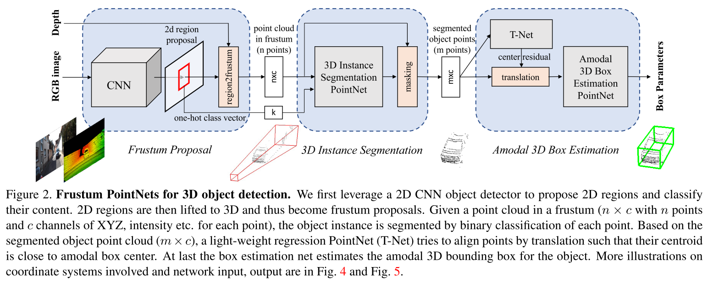
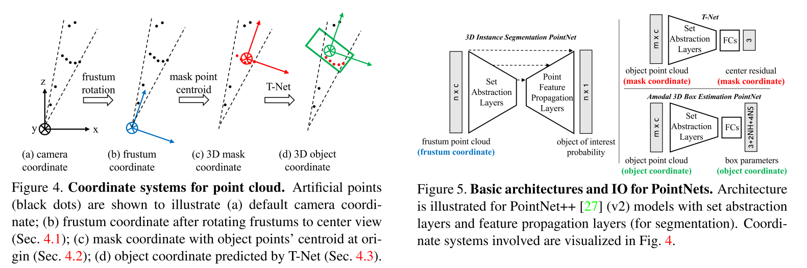
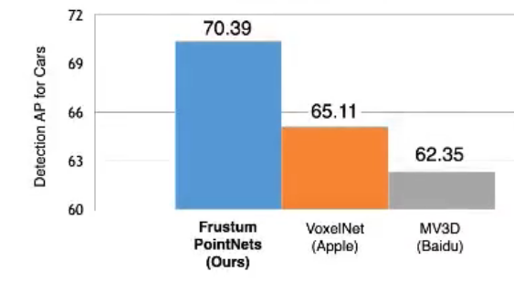

## 基于图像+点云的3D目标检测

一、Frustum PointNets

​		论文《Frustum PointNets for 3D Object Detection from RGB-D Data，2017》先在图像上检测目标物体的2D框，之后基于2D框可以得到3D点云的frustum，此时该frustum虽然缩小了物体的范围，但是依然具有其他前景和背景的点云，于是，在此基础上采用点云的网络如PointNet进行语义分割，将目标的点云分割出来，进而得到物体的3D位置。

​		其中对于3D点云进行语义分割以及根据语义分割的结果进行目标框检测的结构如下：

​		其中对比结果如下所示：

​		