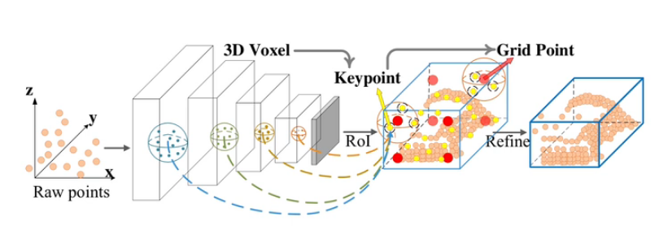
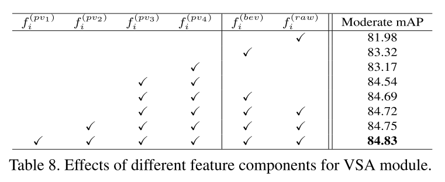

## 基于点云的3D目标检测

##### 概述：

​		3D目标检测解决方式主要分为图像驱动(Image-driven，如Frustum PointNets)、降维(Dimension reduction，如PointPillars)、基于点集网络或稀疏3D卷积(Point set deep nets, Sparse 3D conv, GNNs, 如VoteNet)。

​		室内3D结构更加复杂、物体间挨的更紧密、存在层叠结构；室外铺更开，所以类似鸟瞰图具有一定优势，类似PointPillars；还有类似Votenet、Point-RCNN、Image-drive的方式也可以。

##### 一、PointNet

​		对于PointNet基本思想是对于点云的无序性，需要模型具有置换不变性，即输入点云的顺序变化后，网络的结果不变化，如max公式、求和公式具有置换不变性。

​		所以PointNet基本思想是对每个点进行特征提取(卷积或者全连接)，在通过Max得到全局信息进行输出，核心结构如下：

​		对于实际PointNet的网络结构如下：

​		这里对于input transform、feature  transform等结构后来验证是作用不大的，所以其核心方式就是通过全连接将固定n个点的维度不断升高到1024，之后再纵向维度上取最大值得到全局的1024维特征，之后通过全连接进行k分类；

​		对于语义分割是在n*64的特征项上，每个点从64维特征增加1024维全局特征，之后得到1088维特征，之后对每个点进行m类别分类，完成语义分割任务。

##### 二、PointNet++

​       论文《PointNet++: Deep Hierarchical Feature Learning on Point Sets in a Metric Space，2017》是在PointNet的基础上发展而来的，因为PointNet是每个点进行独立的特征提取，最后融合成一个总的特征，但是这个过程中没有对邻域的点云特征进行融合，PointNet++在这方面进行了改进。具体结构与步骤如下所示。

 		假设点云具有20000个固定输入点：

(1) 选择N1(如2048)簇中心点；

​		首先采用确定的采样点个数作为簇中心店，如2048个簇中心点。该过程称为sampling&grouping过程，取这2048个簇中心点是按照FPS (最远点采样)算法选择出的，即先选择第一个点，选择下一个点时是遍历其他点，选择与已经选择簇中心点距离最远的。最终选择2048个簇中心点；

(2) 设定簇半径，选择固定点数空间点；

​		选择半径0.1、点个数20，对于少于20个点的，则选择簇中心点最近的一个点，复制到20个点，如果多于20个点的，则按照簇中心点距离大小排序，最后选择最近的20个；

(3)每个簇采用pointnet的方式得到K维特征，最终变成(N1, d+C1)；

​		每个点经过MLP从6维(3维空间信息+3维矢量信息)变成K维特征，由于每个簇有20个点，最终通过max得到这个簇的K维信息，max(20,K) = K

(4) K 到C1可以采用多种半径和点数进行特征concatenate；

​		0.1  20、0.2  40、0.4  80

​		每个簇设定多个半径和点数，之后每个设置得到K、M、N维特征，将多个特征concatenate起来变成C1维，即C1 = K + M + N

(5) 由于每一次迭代会得到Nx,Cx维特征；但Cx前3位是空间位置，所以每次迭代都可以继续保留小目标固定簇点数特征；

##### 3D压缩到2D的方法：

##### 二、VoxelNet

​		对于不规则的点云转换成规则的点云，即将一个固定的空间长方体按照长、宽、高等比例划分，得到规则的体素。在一个voxel内的点的信息提取出来得到voxel的表示，如果没有点则使用空的voxel表示，这时可以使用高效的sparse 3D卷积网络进行处理，之后可以压平到BEV平面，之后通过二维的方式进行处理。

##### 三、PointPillar

​		PointPillar在思想上与VoxelNet比较相似，该结构快速将这个柱子高度内的点云通过PointNet等网络结构压缩到平面上，因为在自动驾驶的场景中物体大部分位于一个平面上。之后采用2D的方式进行处理，该结构比VoxelNet更快且更好优化。

##### 四、CenterPoint

​		CenterPoint实际上是在其他backbone结构的基础上进行了任务head的优化。如采用VoxelNet或PointPillar将点云转换到2D空间下的特征图。

​		在2D空间中可以基于anchor的结构进行目标检测，即在2D的平面上铺满anchors。如下：

​		但是在车辆转弯的情况下，anchor的方向与车辆的方向可能不一致，称为rotation misalignment问题。

​		所以CenterPoint不基于anchor进行物体检测，而是通过检测物体的中心点来进行物体检测。得到中心点后，根据中心点的特征进行3D信息的检测，如3D size、朝向。

​		为了得到更好的性能通过2阶段进行检测，即通过1阶段检测到的box，选择中心点以及四条边的中点组合起来进行边框的refine。

##### 直接利用3D的稀疏性进行检测：

​		直接利用3D点云的稀疏性进行检测的核心思想是直接在稀疏点云上进行特征提取，采用的backbone类似PointNet++、Sparse 3D convnet。 相关的网络有PointRCNN、STD、3DSSD、Pv-rcnn等

##### 五、VoteNet

​		论文《Deep Hough Voting for 3D Object Detection in Point Clouds，2019》通过对每个进行特征提取，之后筛选出种子点，每个种子点会进行目标中心点的投票，通过对投票进行聚类得到不同物体中心点，再通过这些投票点进行目标检测。

##### 

六、PV-RCNN

​		在点云3D目标检测中一般有两种方式进行特征提取，一种是基于点集提取特征的方法，最早有PointNet++中提出来的这种方式的优点是具有灵活的感受野，同时可以保留比较准确的location信息。另一种是基于Voxel的稀疏卷积，优点是效率更高，同时可以利用2D CNN网络产生比较高质量的proposals。

​		论文《PV-RCNN: Point-Voxel Feature Set Abstraction for 3D Object Detection，CVPR 2020》就是将两种提取特征的优势进行了融合。

​		论文中主要分为两个阶段，一个阶段是将Voxel产生的特征融合到抽样得到的keypoint特征上；第二个阶段是将keypoint的特征融合到grid ROI(即proposals区域内的关键件) 的特征上。接下来，先看第一阶段的结构：

​		第一阶段首先在原始的点云上通过FPS进行关键点选取，之后Voxel和point都统一到一个坐标系下，这样关键点周围原始点的特征和sparse voxel的特征可以通过点特征提取的方式(pointnet)进行提取，同时将多尺度的sparse voxel的特征连接起来，得到融合的特征。

​		接下来第二步，在ROI proposals中进行ROI grid pooling得到proposal中一些关键的规则的点，即先采样得到Grid Point，如下图中的红色点，之后会对周围的点进行点集的特征提取并融合到这些红色的grid point上，在提取特征的过程中也可以进行多尺度提取方式。这里还有一个好处就是一些proposal并不是很准，那么通过点集信息融合的方式会把proposal以外的点特征融合到grid point上，进而更好的进行第二阶段的refinement。具体如下图所示。

​		在完成grid point 的特征提取之后，会按照grid point在空间中的位置有序的排列成特征向量，之后refine目标的3D信息。整体结构如下：

​		接下来是一些实验的结论，通过添加不同层的voxel的特征，可以看到增加第3、4、bev和row层点的特征后性能就已经比较好了，增加第1、2层信息性能提升有限，具体如下：

​		对于ROI grid pooling可以通过下面实验看出性能的提升：

​		这里看出Roi-grid pooling提升是在moderate 和 hard上有一定提升。

##### 		提升模型PV-RCNN++

​		首先，PV-RCNN通过融合点集特征和voxel的特征，所以存在速度慢、耗内存高的问题。首先对于速度慢的问题，分析每个迭代步骤中不同阶段消耗的时间如下：

​		可以看出FPS耗时比较高，具体如下面紫色框部分。

​		从kitti的2万个点左右提升到waymo(360度点云)的160万个点后通过FPS采样关键点就会非常耗时。这里有两个分析，一个是背景点实际上对于目标检测的性能影响比较小；第二个是随机采样得到的点要比均匀采样得到的点性能差；

###### 		对于速度提升的方式是：

​		(1) 通过Proposal fitler只采样proposal附近的点，这样会将有限的(4000个关键点)关键点放在有意义的地方；

​		(2) 根据激光雷达的扫描原理，将整个点云空间按照扇形区域划分多个区域，之后根据每个区域包含raw点个数按比例进行关键点的采样，这样整体速度会进一步提高，同时在扇形边界处不均匀对于最终结果影响非常小。

​		以上两个步骤结合称为sectorized proposal-centric sampling。

​		下图是不同的采样方式：

​		第4种是随机分成四组只有进行FPS，这种也会有些地方点聚集。

​		不同方法对应的性能。

###### 		对于内存性能的提升是：

​		性能主要消耗是在点集特征提取部分，即对关键点周围邻域选取的点进行特征提取，提取采用share的MLP进行，当选取邻域点比较多时比较消耗内存。

​		那么需要保持点云局部特征的有效性，文章中采用VectorPool Aggregation的方式，即将关键点周围的点云按照一定规律进行编码，即将一个空间平均分成子voxel的空间，通过提取子voxel的特征后在进行连接得到整个邻域的特征。不同的子voxel采用不同的weight。

​		通过上述方法保留了特征同时降低了计算量。

​		这个操作实际是一个比较普适的降低计算量的操作，这里将该操作应用在voxel set abstract module和roi-grid pooling module上述两个位置。通过这样的处理计算量明显降低了。

​		通过做不同的分析实验，有一些结论。如采用共享的voxel的权重性能会下降，同时对于roi-grid 分成不同个数时，性能不同，在3、3、3时是性能最好的。还有keypoints更多时也没有更多性能增加。下图是对关键模型结构的替换后的性能。

其他相关的工作：

​		Voxel-RCNN：实际是pv-rcnn的简化版，2