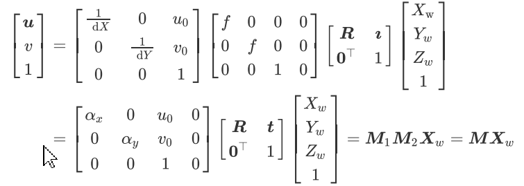

# 多视图三维重建

## 一、基于MVS的三维重建基础知识

### 1、三维信息表示方法

​		三维信息一般用深度图(depth)和视差图(disparity)来表示。

​				深度图：场景中每个点到相机的距离

​				视差图：同一个场景在两个相机下成像的像素的位置偏差dis

​		两者关系：depth=bf/dis，具体参见如下图：

​		其中深度表示P点距离像平面的距离，视差是指P点在左右图像上像素的误差。

​		三维信息的常用表示方式：

​		(1) 三维点云

​				三维点云是某个坐标系下的点的数据集，其中包含了三维坐标xyz、颜色rgb等信息。

​		(2)三维网格(mesh)

​				由物体的邻接点云构成的多边形组成，一般由三角形、四边形等组成

​		(3)纹理贴图模型

​				带有颜色信息的三维网格模型，所有的颜色信息存储在一张纹理图上，显示时根据每个网格的纹理坐标和对应的纹理图进行渲染得到高分辨率的彩色模型。

### 2、图像坐标系、相机坐标系、世界坐标系间的转换

(1) 图像坐标系

​		图中，(u,v)是表示以像素为单位的图像坐标系的坐标，(X,Y)是以mm为单位的图像坐标系的坐标，O1是相机光轴与图像的交点其对应的像素坐标(u0，v0)，每个像素在x轴和y轴对应的物理尺寸dX，dY。两者转换关系如下：

​	用矩阵的表示形式：

​	其逆关系如下：

(2)相机坐标系与世界坐标系

​		如下图所示，O为相机光心，xy轴与图像的XY轴平行，z轴为相机光轴与相机图像平面垂直交点就是图像坐标原点。O与xyz组成的执教坐标系为相机坐标系，OO1为焦距。

​		世界坐标系与相机坐标系转换关系：

​		式中R为3*3的正交单位矩阵，t为三维平移向量，0T	=[0,0,0]，M2为4 * 4 矩阵。

​		相机投影模型，该模型可以理解相机坐标系与图像坐标系之间的关系。相机投影模型如下：

​		根据图像平面与针孔平面的关系，可以将图像平面放到针孔前方焦距为f的位置(数学上等价，计算更简单)：

​		当已知图像点p时，由针孔成像模型，任何位于射线OP上的空间点的图像点都是p点，因此空间点不是唯一确定的。

​		所以从世界坐标系到图像坐标的转换关系如下：

​		这里实际上等号左边需要乘以一个z。其中ax和ay称为归一化焦距，(ax，ay，u0，v0)只与相机内部参数有关，被称为相机内参；R，t由相机相对世界坐标系的方位决定，被称为相机外参。确定相机内外参数被称为相机标定。

### 3、对极几何

​		多视图深度估计主要使用的原理是对极几何，具体结构如下图所示：

​		其中，极点el,er为左右相机坐标原点连线在左像平面上的像和在右像平面上的像。

​		极平面pi：由两个相机坐标原点和物体点P组成的平面；

​		极线lpl、lpr：极平面与两个像平面的交线。

​		极线约束：给定图像上的一个特征，它在另一个图像上的匹配视图一定在对应的极线上。

​		极线约束给出了对应点重要的约束条件，它将对应点匹配从整幅图像中查找压缩到了一条线上查找，大大减小了搜索范围，对对应点的匹配起指导作用。

### 4、MVS重建算法流程		

​		常用的重建算法主要有：Plane Sweeping和PatchMatch。

​		 MVS三维重建的核心就是立体匹配，通过两幅图像的对应点的匹配关系可以根据三角测量关系得到深度信息实现三维几何重建，流程如下：

​		深度图初始化

​		匹配代价计算(光度一致性测量)

​		匹配代价聚合

​		深度图计算

​		深度图优化，滤波等后处理

(1)传统Plane Sweeping介绍

​		平面扫描算法将深度范围内分为一个个平面，深度范围根据实际需要设定。空间物体表面上的一点M一定位于众多平行平面中的一个平面上。判断曲面上一点在哪个平面上的方法可以通过看M在个相机是否是同一颜色，也就是物体点M本来的颜色。

 

算法步骤：

(1) 深度图初始化

​		根据深度范围(dmin, dmax)，等间隔初始化m层深度；		

(2)匹配代价计算

​		对于plane sweeping方法，其中平面可以通过两个相机的内外参，将左相机对应的所有像素映射到右图像上，通过单应矩阵，具体如下：

​		 常用匹配代价：NCC, Census

​         (1) 使用像素邻域内灰度差异将像素灰度转换为比特串；

​		(2)通过比特串得到汉明距离

(3) 代价聚合

​		由于代价计算步骤只考虑了局部相关性，对噪声非常敏感，无法直接用来计算最优视差，通过该步骤，使聚合后的代价值能够更准确的反应像素之间的相关性。常用算法：SGM

(4)深度图计算

​		根据匹配代价，从深度层中选择代价最小的层对应的深度即是计算的最佳深度，对于亚像素则是根据附近的值拟合曲线进行计算。

### 5、MVSNet论文解读

(1) 摘要

​		本论文实现了端到端的利用多帧图像来计算深度图；

​		整个算法步骤如下：

​				提取图像特征；

​				基于相机视锥体空间构建3D代价体，通过可微的单应矩阵warping；

​				使用3D卷积正则化并回归出初始深度图和置信度图；

​				用参考图优化初始深度图得到最终的深度图；

​		通过使用基于方差的代价指标将多个特征体映射为一个代价体，从而支持任意N个图像输入；

(2) 特征提取

​		网络：使用8层2D卷积神经网络，使第3层、第6层的卷积步长设为2(每次图像分辨率会减少一半)，特征提取网络的参数共享权重。输入是N张图像，输出是分辨率原图的1/4，通道是32的N张特征图。整个网络架构如下图所示：

()实现

​		采用点云真值通过screened  poisson surface reconstruction来生成mesh 表面，之后将mesh反投影得到深度图。

