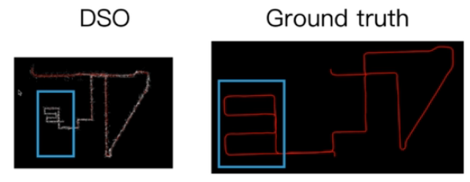

# 深度学习SLAM

## 一、NICE-SLAM：

​		论文《NICE-SLAM: Neural Implicit Scalable Encoding for SLAM,2021,zihan zhu》

**1、摘要**

​		隐式神经表示最近表现出很好的结果，包括在SLAM中。然而，已存的方法得到的重构场景过于平滑也很难扩展到大场景，主要原因是使用简单的全连接网络同时也没有包含观察的局部信息。本文提出NICE-SLAM，一个包含多层级局部信息的稠密的SLAM系统被提出。与最近的神经隐式SLAM系统对比，我们的方法更加可扩展、高效并且鲁棒。

2、介绍

​		在本文中，对于稠密SLAM任务，我们结合层级场景表示和隐式神经表示。最终，我们介绍的nice-slam是一个稠密RGB-D SLAM系统，他可以应用在大尺度场景并且保留预测能力。我们的主要思想是使用层级特征栅格表示场景的几何和外观，同时合并在不同尺度上训练的隐式神经编码。通过显示深度和色彩图片，我们可以在视角区域最小化显示losss来优化特征栅格。我们再室内数据集进行大量的验证我们算法的性能。主要的贡献如下：

(1)我们提出nice-slam，一个rgb-d slam系统，具有实时、可扩展、预测并且鲁棒的系统适应有挑战的变化场景；

(2)核心nice-slam是一个层级的、基于栅格隐式神经编码。相对于全局神经场景编码，这个表示可以进行更新，这个是大尺度方法的前提需求；

(3)我们进行广泛的数据集进行广泛评估，这个验证了在建图和跟踪具有竞争力性能。

**3、相关工作**

​		稠密视觉SLAM。 大多数现代视觉SLAM方法都依照开创性的[16]工作中提到的框架，将任务分解为建图和跟踪。建图可以分为两种类：视觉中心和世界中心。第一个3D几何中心锚点到关键帧是以深度图为代表。最早的这类方法是DTAM[25],由于他的简单性，DTAM已经被用于很多最近的基于深度学习的SLAM系统中。例如[49,62]回归深度和位置更新。DeepV2D类似的交替回归深度和位置估计，但是使用测试时间优化。BA-Net[46]和DeepFactors[11]使用一组基深度图来简化优化问题。有一些方法，如CodeSLAM[2]、SceneCode[61]和NodeSLAM[43]优化解码到关键帧或目标深度图中的潜在表示。DROID-SLAM[48]使用回归光流来定义几何残差进行优化。另一方面，以世界中心的地图表示将三维几何图形锚定在统一的世界坐标中，可以进一步划分为surfels和体素网络，通常存储占据和TSDF值。体素栅格已经用于拓展RGB-D SLAM，例如KinectFusion在其他工作[4,13,15,29]。在我们提出的流水线一绕采用体素栅格表示。相对于之前的SLAM方法，我们存储隐式几何代码并在建图中直接优化。这个丰富的表示允许我们来获得更准确的几何在低栅格分辨率上。

神经网络隐式表示：最近，神经网络隐式表达证明在目标几何表达[7,18,20,28,30--32,36,50,54,57,58]、场景完成[5,14,33]、新视角合成[19,21,34,60]、生成建模[6,26,27,39]等具有很好的结果。一些最近的文章[1,3,8,23,44]都尝试预测场景级几何，但他们都假定摄像头位置已知，另一些工作[17,51,59]处理摄像头位置问题作为优化，但是需要比较长的优化处理，这不满足实时应用要求。

​	 	与我们工作最相关的是iMAP[42]，给定一组RGB-D序列，他们引入一个实时的稠密SLAM系统，该系统采用一个多层感知机来紧凑表示整个场景。iMAP表示具有同时估计场景几何和颜色，同时进行摄像头跟踪。然而，由于单层MLP模型能力的限制，他们预测重构和颜色不能获取足够的细节。更多的，我们注意到iMAP在大场景将会失败。类似的，持续网络建图[55]融合一系列深度图到一个连续的神经网络场景表示中。与IMAP类似，整个场景 编码也是利用一个MLP结构，这也限制了这两种方法的扩展性。

​		相反，我们相对于iMAP提供一个可扩展的方法，该方法结合了一个心乱的连续隐式解码器和可学习的隐式编码。通过这种方式，我们的方法可以重构大型的复杂的几何场景和预测详细的纹理，同时可以保证快速收敛。可以注意的，[14,33]两个工作结合传统栅格结构和学习特征表示，但两者也都非实时的。

**4、方法**

​		下面是我们的方法框架。

​		文章中只是介绍了一些思想而没有介绍结构，需要通过相近文章理解，如iMAP.

已知摄像头位置进行场景级别构建:

[8]Volumefusion: Deep depth fusion for 3d scene reconstruction,2021,ICCV; 

[23] Atlas: End- to-end 3d scene reconstruction from posed images,2020

[44]Neuralrecon: Real-time coherent 3d reconstruc- tion from monocular video,2021

摄像头位姿作为优化问题处理：

[17]Barf: Bundle-adjusting neural radiance field,2021,ICCV

[51]Nerf–: Neural radiance fields without known camera parameters,2021

[59]inerf: Inverting neural radiance fields for pose estimation,2020.

[42]iMAP: Implicit mapping and positioning in real-time,2021,ICCV

[55]Continual neural mapping: Learning an implicit scene representation from sequential observations,2021

##  二、iMAP

### 1、摘要		

​		我们第一次展示用MLP来进行场景表示在实时SLAM系统。我们网络没有使用先验数据情况下现场训练并得到一个稠密、具有占据和色彩的场景。

​		通过实时图像流持续训练获得实时SLAM模型需要重要创新。iMAP方法使用关键帧结构和多处理计算流可实现10HZ的跟踪和2HZ全局地图更新。使用隐式MLP的优点是高效的几何表示并在未观测区域具有一定的平滑性。

2、简介

​		在跟踪过程，我们讲RGBD观测结果和MLP场景中渲染的深度和颜色预测结合起来。与此同时，建图过程选择并维持一组历史关键帧，使用这些视角点来持续训练和改进MLP，同时共同优化关键帧姿态。

​		在跟踪和建图过程中，我们动态选取最具信息的RGBD像素来减少几何不确定。将SLAM视为一个持续学习问题，我们实现一种具有连续和自适应分辨率的场景表示，同时具有平滑插值能力，实现完全的场景重建。

​		本文贡献：

​		(1) 这是第一次使用隐式神经场景表示进行实时SLAM并具有优化全局3D地图和摄像头位姿的能力。

​		(2) 具有实时训练隐式场景网络的能力，自动是能关键帧选择以及引导稀疏采样。

​		(3) 采用手持RGBD相机实现SLAM功能。

3、相关工作

​		实时SLAM对于场景的表示一般采用分层方式，一层是用于稀疏表示用于定位，之后细化的表示是在上一层。本文采用的统一深度场景表示是相机跟踪的基础。稠密表示可以避免按照不同需求来进行提取，同时可以得到统一完全的空间表示。

​		标准的占据表示和符号距离方程表示在固定分辨率情况下非常占内存。对于像CodeSLAM是采用深度图表示并且可以进行整体联合优化。基于学习的方式需要训练数据。

​		对于采用MLP进行隐式场景表示的方法有比较多，同时也有优化摄像头位姿的，但是这些方法时间比较长。本文发现如果深度图可以获取，并用于引导稀疏采样进行显示和训练，这些方法就适用于实时SLAM.

​		将单MLP作为场景模型，我们提出了实时SLAM在线持续学习。一个有效持续学习系统需要可塑性和稳定性，灾难性忘记是神经网络一个众所周知的性质，即新的经验会覆盖记忆，这是稳定性的一种失败。我们这里采用一种基于回放的方式来进行持续学习，及之前的知识记忆在一个buffer中或者压缩在一个生成模型中。我们使用简单的方法来自动选择关键帧并压缩之前的记忆。使用loss来引导关键帧的随机采样和地图更新来增加场景的感知理解。这个方法优点类似PTAM[11]，使用历史关键帧集合并重复全局优化。

4、iMAP，a real-time implicit slam system

(1) 系统总体架构

​		下图是总体框架图。一个3D体度量地图用F_theta表示，它将3D坐标映射为颜色和空间密度。对于一个给定的相机姿态，我们可以通过反向投影光线积累来呈现像素的颜色和深度。

​		我们通过一组稀疏的主动采样度量来逐步优化网络权值和摄像头姿态，进而从深度和颜色视频来映射场景。

​		有两个进程在同时运行，跟踪用于根据网络进行当前帧姿态优化，建图用于优化网络和关键帧的摄像头位姿。

(2) 隐式场景神经网络

​		依据NeRF网络结构，我们也使用了4层MLP，两个输出头，一个是3D坐标，一个是体密度值。不想NeRF，我们没有考虑视觉方向，因为本文没有重点考虑对高反物体进行建模。本文使用傅里叶特征网络[32]中提到的高斯位置编码来将3D坐标提升到n维空间，sin(Bp)，B是n*3的矩阵，通过采用标准差为delta的正态分布。

(3) 深度与颜色渲染

​		本文新的可微显示引擎是来着NeRF和NodeSLAM的灵感，根据给定视角去请求场景网络来获取深度与颜色图像。给定一个相机位姿和一个像素坐标[u,v]，我们首先将它反投影到归一化的视角方向并转换到世界坐标。我们沿着射线方向选择N个采样在对应的深度上并请求网络得到颜色和体密度。我们采用NeRF这种分层及分等级的采样策略。其公式如下：

​		这里ci是颜色信息，roli是体密度，通过激活函数可以转换为跟采样距离相关的占据概率，进而得到每个采样位置的占据概率。具体如下：

oi=

(4) 摄像头跟踪

​		在线SLAM，接近帧率的摄像头跟踪是重要的，因为较小位移的优化更鲁棒。我们同时运行一个处理来更高速的持续优化最新的帧位置，跟踪位置初始化在地图处理过程中被优化。

(5) 关键帧选择

​		采用视频所有图像来优化网络参数和摄像头位姿在计算量上是不可行的。因为具有大量的冗余图像，我们基于信息增益来持续选择一组稀疏的关键帧。初始帧是被选择的并设置为世界坐标原点，每个关键帧增加的时候，我们会锁定3D地图并给出一个快照。后续帧会跟当前帧进行对比，当对比明显时会选择为关键帧。

## 三、TANDEM

(1) j摘要

​		本文 提出一种实时单目跟踪及稠密建图的建构。针对位姿估计，本文采用一个滑动窗口关键帧的光度光束法平差调整。为了增加稳定性，我们提出了新的跟踪前端用于执行稠密方向图对齐。为了预测稠密深度图像，本文提出级联视图聚集网络CVA-MVSNet用于对整个窗口中关键帧构建3D代价体用于平衡不同双目baseline。最终，预测的深度图融合到一个全局一致的地图，采用TSDF体素grid来表示。我们的结果显示单目里程计和实时3D建图性能都最好。

(2)介绍

​		实时稠密3D建图是计算机视觉和机器人领域最大的挑战之一，这个被称为稠密SLAM，包括传感器的6DoF估计和周围环境的稠密重建。虽然有大量的鲁棒的RGB-D建图方案，从单目进行实时稠密重建是重要的。

​		几种深度神经网络的方法被提出来解决单目跟踪及稠密地图重建，该过程利用单目深度估计、变化自动编码或端到端神经网络。与之前工作不同，本文我们提出一种新的单目稠密SLAM方法，集成了多视角双目视觉到基于传统优化VO中并取得了比较好的性能。

​		主要贡献：

​		(1) 一个新的实时单目稠密SLAM框架与经典直接VO和基于学习的MVS重构进行匹配；

​		(2) 这是第一个单目稠密跟踪前端，它利用一个全局的TSDF模型的深度呈现；

​		(3) 一个新的MVS网络，通过利用视图聚集和多阶段深度预测实现利用整个窗口中的关键帧；；

​		(4)在合成数据和实际数据中良好的跟踪和重建结果。

(3) 方法

​		TANDEM由3个模块组成：单目视觉里程计、稠密深度估计、体度量建图。单目视觉里程计利用单目视频流和3D TSDF模型的稠密深度呈现以滑动窗口的方式进行相机位姿估计。在给定关键帧和他们估计位姿，CVA-MVSNet预测每个参考关键帧的深度图。为了重构一个全局一致的3D环境模型，深度图最后通过体素哈希融合到TSDF体素栅格中。通过无缝集成这些模块，TANDEM可进行实时跟踪和高质量稠密建图。具体结构如下：

(a)使用视觉里程计优化的稀疏点和3D模型渲染的稠密深度图跟踪每帧，关键帧的姿态通过滑动窗口光度束调整进行估计，并输入CVA-MVSNet进行稠密的深度预测，深度贴图融合为全局一致的TSDF体积；

(b)CVA-MVSNet构建级联成本量并分层估计深度图，视图聚合模块通过预测自适应权重，有效地聚合多视图图像的特征；

​		**视觉里程计：**

​		通过跟踪多帧稀疏点集估计摄像头位姿的方式在最新的VO系统中已经有比较高的性能。使用更多的点来联合优化不能更好的提升性能反而影响运行速度。因此，我们提出的VO系统使用直接稀疏窗口优化后端，类似DSO。然而，我们利用全局TSDF模型的稠密深度地图呈现进行图像前端对齐。大量实验表明抽面跟踪前端及稀疏后端优化比较大的改善跟踪性能。

​		稠密前端跟踪：前端跟踪是提供摄像头频率的位置估计并用于初始化窗口的后端优化。在原始的DSO中，每一个新的帧是跟最后一个关键帧采用稀疏深度图直接进行图像对齐来进行跟踪，稀疏点是优化窗口生成的所有点。这个方法会由于稀疏深度图而缺少鲁棒性。我们利用稠密深度图Dn(TSDF）来减缓这个问题，该深度图是从TSDF模型中获取的。对于当前关键帧n的每一个像素p，如果有离散VO点就赋给深度值，如果没有，基于TSDF得到呈现深度值。虽然得不到所有的深度值，但已经比较稠密了。这个接近稠密深度图用于两帧的直接图像对齐。

​		**CVA-MVSNet：**

​		这里首先获取一组有效的图像和pose集合，这里T是通过VO获取的全局位姿。

​		单阶段深度估计：对于每一个阶段，代价体Cs需要采用Fis深度特征来重构。对于参考帧的每个像素，我们定义了Ds深度假设，即得到假设深度tensor(Ds, Hs,Ws)。每一帧的深度特征Fsi通过可以微分warping进行几何转换。结果，对于每帧一个特征体Vis被构建，其大小为(Fs,Ds,Hs,Ws)。为了将多视角特征聚集到一个代价体Cs，大部分之前的深度MVS方法平等的对待不同视角并使用基于方差的代价度量。

​		然而，在滑动窗口SLAM设置中，关键帧并不是均匀分布在优化窗口。这引起了大量的遮挡和非重合图像。这种基于方差代价体将多视图等权重的方式是不合适的。为了缓解这个问题，我们使用自适应视图聚集来重构代价体：

​		这里视图聚集权重W的维度是(1, Ds, Hs, Ws)同时圈星是元素乘。这里聚集权重W通过一个浅的3D卷积网络来估计。对于每个Vis采用(Vis-Vjs)2作为输入。这种聚集模块运行网络自适应对错误信息降低权重。

​		实际上这里的代价体是通过滑动窗口中多帧图像得到的特征体构成的，简单的方式通过平均当前特征体与其余特征体均值的方差，本文是在此基础上增加了权重学习。

 		代价体Cs采用3D U-Net进行归一化并最终通过一个softmax来获取概率体Ps-》（Ds, Hs, Ws）,得到预测深度如下:

​		**级联深度估计：**网络利用上一阶段Ds-1的深度估计来优化细粒度的深度假设张量。对于第一层采用相同深度区域范围，对于后面的阶段，深度通过上采样用于定义假设深度。对于像素(h,w)采用上一阶段该位置周围的值以及偏置得到。

## 四、CNN-SLAM

三、最佳开源SLAM算法

1、TANDEM:

(1)直接VO和基于学习的MVS重建无缝结合；

(2)第一个利用全局TSDF模型渲染的深度图，实现单目稠密跟踪前端；

(3)一种新的MVS网络，CVA-MVSnet，能够通过视图聚合和多级深度预测来使用整个关键帧窗口；

2、MonoRec：使用单目相机在动态环境下，实现半监督稠密重建。结合了深度MVS和单目深度估计算法，使用maskmodule识别移动像素，降低代价体重相应体素的权重，在利用depth module，从而实现对静态和动态物体进行深度估计，该工作可以用于包含动态场景的三维重建和场景理解；

3、R3LIVE

​		将开源视觉+激光+惯导的多传感器融合SLAM系统；实时同步定位、建图和着色的框架，能够实时、低漂移低重建稠密、精确的三维彩色环境点云地图；目前github只有开源图片和了论文。

## 四、视觉SLAM基础知识

1、视觉SLAM主要可以分为前端后端，一些完整的传统SLAM系统还包含回环检测和建图，这里最核心的部分是前端和后端，即：

​	对于前端主要包含以下几部分：

(1)data selection

​		追踪点和关键帧，这里追踪点是指选择特征较强的点，关键帧是选择图像变化较大的帧。

(2)data association

​		特征匹配或者光流来进行特征点的匹配，之后可以根据匹配的结果实现同一3D空间点在不同图像上的对应关系；

(3) initial pose and depth estimation

​		有了关联点后估计pose和depth，间接法一般有geometric approach，通过几个点计算homography matrix等；当系统初始化之后，估计当前帧就会相对容易，将3D的点投影到当前帧，得到当前帧的pose。

​		对于后端问题如下：

（1）后端实际上就是优化问题，相当于将多帧图像的pose和所有关联点的3D信息进行联合优化，最终得到最优的pose和深度图。具体如下：

​		深度学习用在SLAM中解决的问题,		一些在SLAM中可以用到深度学习:

（1）optical flow ->flownet

​		网络输入两张图片，一个网络结构是将两张图片叠加进行卷积，之后得到光流结果。

​		这里存在的问题只是将两张图片叠加在一起进行学习，而光流实际上是关注两张图像中像素的关系。那么网络结构如果能够显式的指定像素间关系，则学习更好。

​		中间关联的是第一张图中的一个向量与另一个图像中对应像素周围的几个点进行内积。

​		要有PWC-Net是通过级联的方式实现coarse-to-fine的效果。

（2）Stereo Depth estimation GC-Net

​		GC-Net是通过双目特征图进行构建代价计算，通过3D卷积实现代价聚合最后得到深度图的过程。

(3) MonoDepth 

​		论文《Unsupervised monocular depth estimation with left right consistency》采用左目来预测右图和左图的深度，之后通过右图深度和左图恢复出右图，用左图深度和右图恢复出左图，之后根据左图深度反投影到右图，获取右图的sample构成新的左图，之后通过构成左图与原图之间的photometric error进行loss计算优化网络。

(4) SfmLearner - unsupervised

​		另一篇通过无监督学习单目深度的文章《Unsupervised learning of depth and ego-motion from video》，该论文采用了两个网路，一个是depth cnn用于预测深度，一个是pose cnn用来预测，最后的loss function还是photometric error。单帧预测的深度通过pose预测的pose转换到前后两帧图片上，这样与前后两帧图片通过相似度进行loss计算。

​		深度学习在SLAM中的应用。

​		对于使用单目进行SLAM的方法由于尺度无法保持，所以尺度会发生变化，如下图所示：

(1) mono depth+dso

semi-supervised Monocular Depth Estimation

​		这里通过photometric erro+smooth error，同时通过Stereo DSO获取稀疏真值，之后训练单目深度网络。

 Deep Virtual Stereo Odometry(DVSO)

(2)CodeSLAM

​		通过compact的特征向量来表征三维空间中的信息，通过SLAM的优化来进一步学习三维空间中的特征。loss function包含photometric loss和geometric loss。

