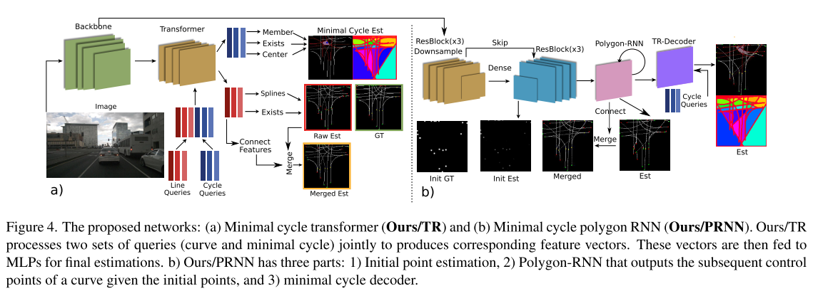
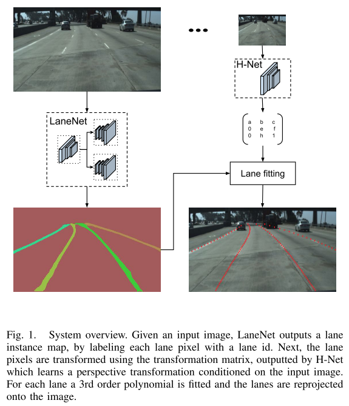
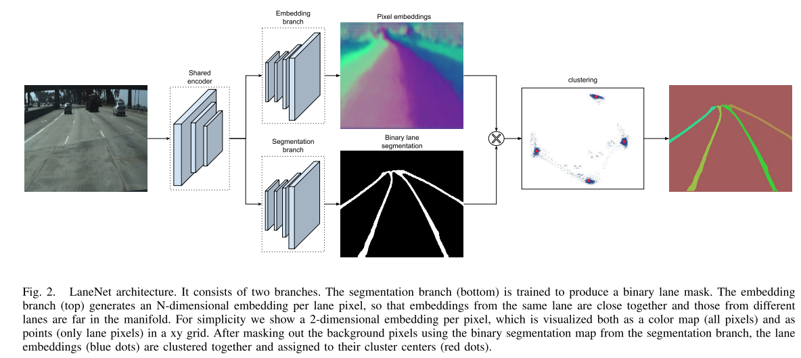
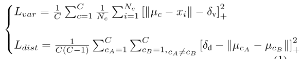

## 车道线检测

##### 一、基于单目图像的局部路网拓扑估计

​		论文《Topology Preserving Local Road Network Estimation from Single Onboard Camera Image，2021》主要工作是在复杂的城市环境中，直接在鸟瞰图(BEV)中提取局部路网拓扑结构。这里使用有向车道曲线以及它们的交点来表示道路拓扑，这里也引入了最小圆(minimal cycle)和覆盖(cover)来表示拓扑。

​		本文的核心是建立了最小圆和覆盖的概念，并证明了可以用这两个描述道路拓扑，并以此来监督网络学习这两个结果。目前从文章结果上看效果并不好，但思想是比较有趣的。所以具体内容就不深入讨论。

##### 二、LaneNet

​		论文《Towards End-to-End Lane Detection: an Instance Segmentation Approach，2018》指出，之前的车道检测活用传统方法，这种依赖于人工设计的特征以及启发的方式，这种计算量比较大并且由于环境变化需要不同参数。而最新的基于深度学习将车道线检测作为像素车道分割，因为感受野比较大，即使在没有标志的区域也可以检测，尽管有优势，但基本受限于提前定义固定的车道数目，如本车道。本文的将车道线检测作为一个实例分割的问题，这里每个车道作为一个实例被端到端训练。同时还学习了一个基于图像的透视变换，而不是在顶视图这种固定的变换。

​			本文整个框架主要分为两个部分，一部分同时实例分割的方式将车道线提取出来，即基于语义分割和实例分割的思想，我们设计了多任务网络，分别是车道语义分割分支和车道embedding分支，该结构可以推断任意数量的车道线，以解决车道变化大问题。第二部分是学习了一个透视图到顶视图的转换矩阵，通过学习的转换矩阵可以应对路面非平坦的问题。

​		文章中，最为重要是实例分割，即将每个车道线上的点学习为一个聚类的id，这个是基于距离度量学习的方式采用聚类损失函数(clustering loss function)，术语同一个lane 的像素点的距离比较小。

​		这里通过variance项用于计算同一条车道线pull，另一项是distance项用于计算不同车道线的push。这里假如有C条车道线，第一个式子是C条车道线每一条上点的平均值uc与每个像素embedding value xi之差，当差值大于threshold detla_v才会计算；第二个式子是车道线两两之间的平均值要大于一定阈值delta_d。

​		后续的聚类及通过学习的投影变换矩阵进行变换就是比较成熟的传统方法了，这里就不详细介绍了。

